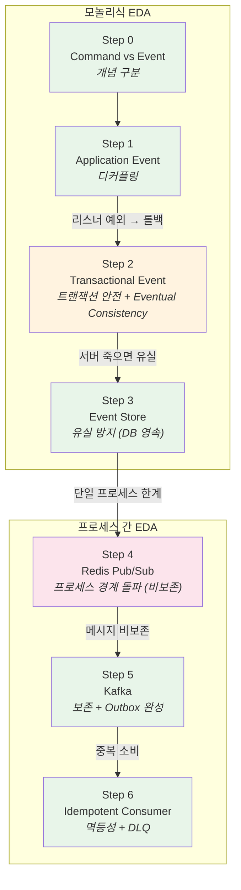
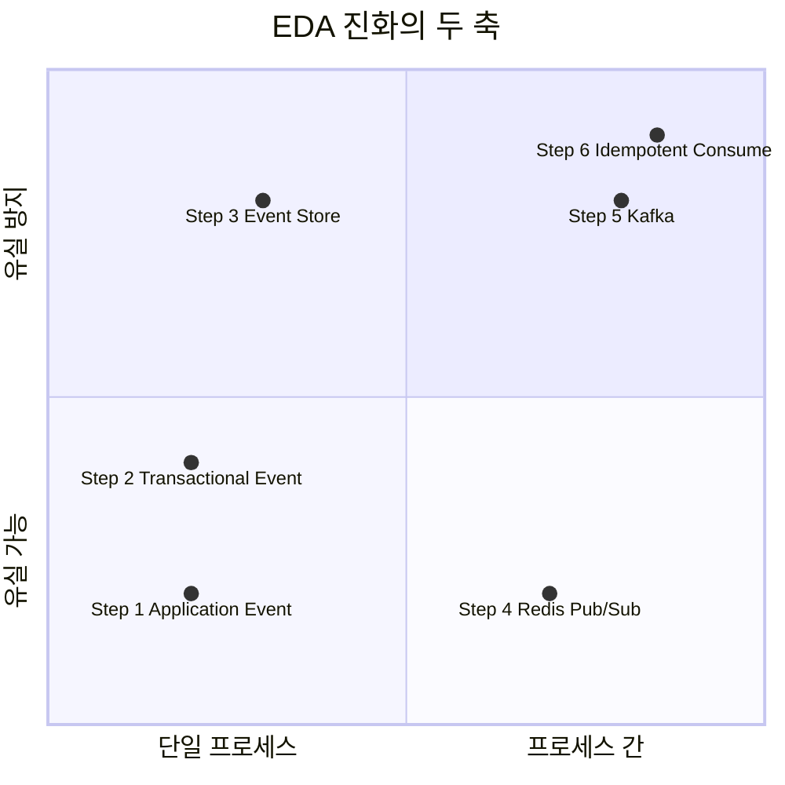
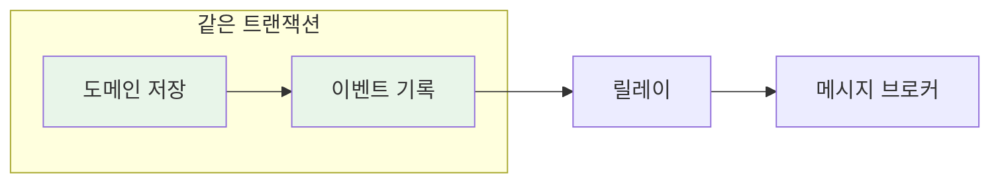
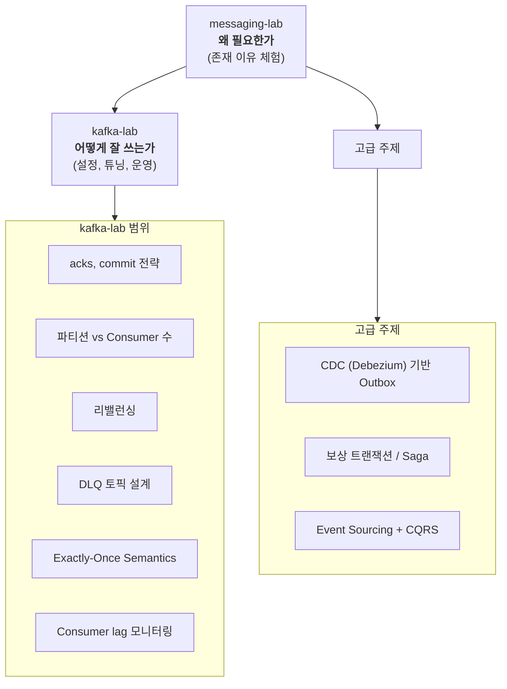

# EDA Context - 이 lab이 보여주는 큰 그림

> 이 lab은 메시징 도구를 배우는 것이 아니다.
> **Event-Driven Architecture(EDA)의 진화를 체험하는 것이다.**

---

## 이 lab은 EDA의 진화를 체험하는 것이다

Spring Event, Redis, Kafka는 **수단**이다.
이 lab이 실제로 보여주는 것은 다음 질문에 대한 답이다:

- 왜 이벤트를 쓰는가?
- 이벤트를 쓰면 뭐가 좋고, 뭘 잃는가?
- 잃은 것을 어떻게 보완하는가?

이 질문에 답하는 과정이 곧 **EDA의 진화 과정**이다.

```
직접 호출 (결합) → 이벤트 (디커플링) → 트랜잭션 안전 → 유실 방지 → 프로세스 간 전달 → 멱등성
```

---

## 모놀리식 EDA vs MSA EDA

같은 "이벤트 기반"이라도, 모놀리식과 MSA에서는 전제 조건이 완전히 다르다.

| | 모놀리식 EDA | MSA EDA |
|---|---|---|
| **이벤트 전달** | 메모리 (ApplicationEvent) | 브로커 필수 (Kafka, RabbitMQ) |
| **트랜잭션** | 같은 DB TX로 묶을 수 있음 | 분산 TX or Eventual Consistency |
| **유실 위험** | 서버 죽으면 메모리 이벤트 유실 | 브로커가 보존하지만 중복 발생 |
| **일관성** | Strong Consistency 가능 | Eventual Consistency가 기본 |
| **디버깅** | 같은 프로세스, 스택트레이스로 추적 | 분산 트레이싱 필요 |
| **복잡도** | 낮음 | 높음 (네트워크, 직렬화, 순서) |

### 이 lab에서의 경계선

```
Step 0-3: 모놀리식 EDA
  - 같은 프로세스, 같은 DB
  - ApplicationEvent → @TransactionalEventListener → Event Store
  - 트랜잭션으로 원자성 보장 가능

────── 관점 전환 ──────

Step 4-6: 프로세스 간 EDA (MSA의 시작)
  - 다른 프로세스, 네트워크 경계
  - Redis Pub/Sub → Kafka
  - Eventual Consistency 불가피, 멱등성 필수
```

---

## Step별 EDA 포지션 맵



### 두 축으로 보는 진화



---

## EDA에서 반복되는 패턴

이 lab에서 자연스럽게 등장하는 패턴들은 EDA의 공통 패턴이다.
특정 도구에 종속되지 않으며, Kafka든 RabbitMQ든 동일하게 적용된다.

### Transactional Outbox Pattern



- **Step 3**에서 절반을 구현했다 (도메인 + Event Store를 같은 TX로)
- **Step 5**에서 완성했다 (Event Store → Kafka 릴레이)
- 핵심: 도메인 변경과 이벤트 발행의 **원자성** 보장

### Idempotent Consumer

- At Least Once 전달이 기본인 환경에서 **필수**
- **Step 6**에서 3가지 패턴을 비교 구현
- 핵심: "발행은 At Least Once, 소비는 멱등하게"

### Dead Letter Queue (DLQ)

- 처리 불가능한 메시지를 **격리**하여 정상 메시지 처리를 보호
- **Step 6**에서 poison pill 문제와 DLQ 격리를 체험
- 핵심: DLQ는 버리는 곳이 아니라 **나중에 재처리할 수 있는 격리 공간**

### Event Store ≠ Event Sourcing

혼동하기 쉬운 개념을 구분한다:

| | Event Store (이 lab) | Event Sourcing |
|---|---|---|
| 목적 | 이벤트를 안전하게 **전달**하기 위한 중간 저장소 | 이벤트를 **상태의 원본**으로 사용 |
| 도메인 상태 | 별도 테이블에 저장 (orders) | 이벤트로부터 재구성 |
| 이벤트 역할 | 전달 수단 | 진실의 원천 (Source of Truth) |
| 복잡도 | 낮음 | 높음 (스냅샷, 리플레이, CQRS) |

이 lab의 Event Store는 **Transactional Outbox**를 위한 것이지, Event Sourcing이 아니다.

---

## 이 lab 이후의 방향

이 lab은 "왜 이 도구가 필요한가"에 답한다.
"이 도구를 어떻게 잘 쓰는가"는 다음 단계의 영역이다.



| 주제 | 다루는 곳 | 전제 |
|------|----------|------|
| Kafka 설정/튜닝/운영 | kafka-lab | messaging-lab Step 5 이해 |
| CDC 기반 Outbox | 별도 주제 | Step 3 + Step 5 이해 |
| 보상 트랜잭션 / Saga | 별도 주제 | Eventual Consistency 수용 (Step 2) |
| Event Sourcing + CQRS | 별도 주제 | Event Store 개념 (Step 3) |
