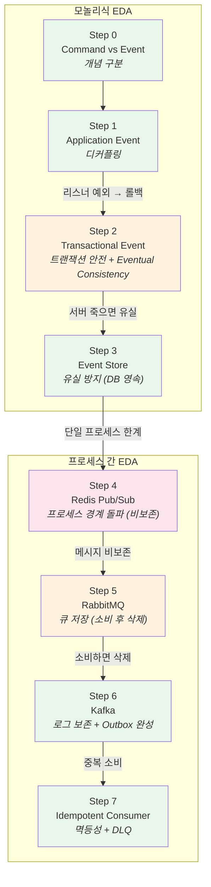
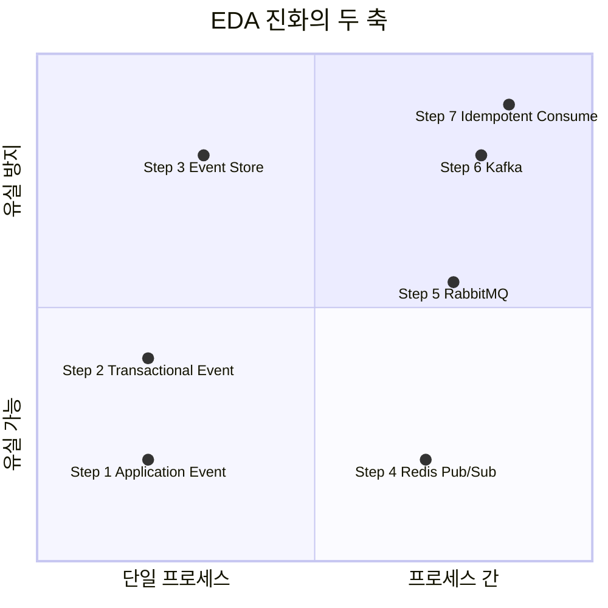
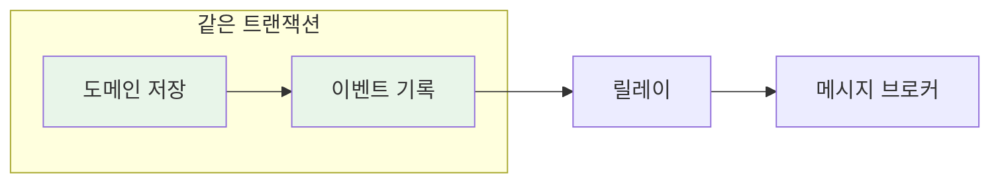
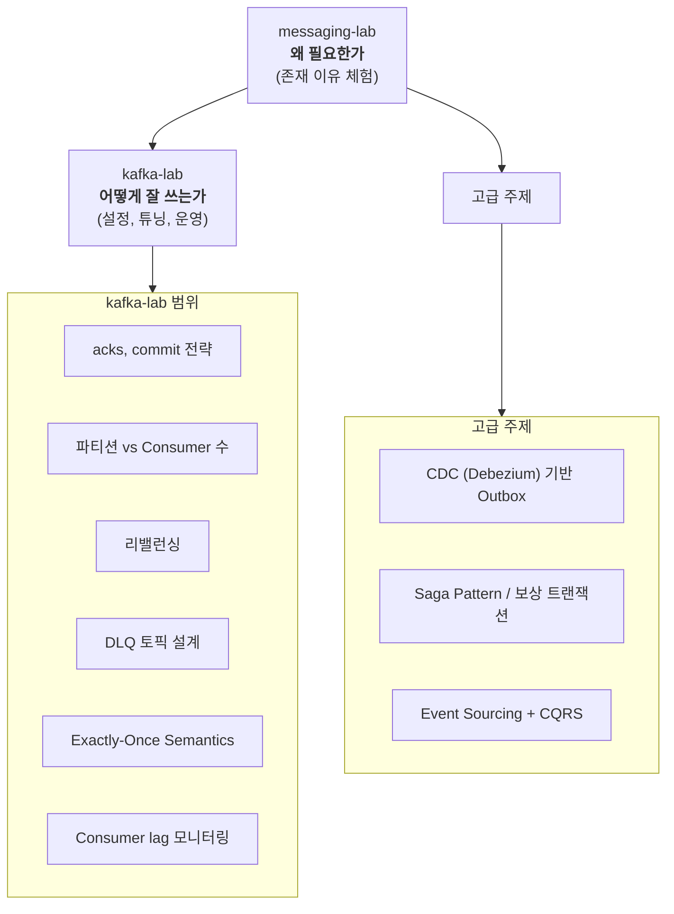

# EDA Overview - 이 lab이 보여주는 큰 그림

> 이 lab은 메시징 도구를 배우는 것이 아니다.
> **Event-Driven Architecture(EDA)의 진화를 체험하는 것이다.**

---

## 이 lab은 EDA의 진화를 체험하는 것이다

Spring Event, Redis, RabbitMQ, Kafka는 **수단**이다.
이 lab이 실제로 보여주는 것은 다음 질문에 대한 답이다:

- 왜 이벤트를 쓰는가?
- 이벤트를 쓰면 뭐가 좋고, 뭘 잃는가?
- 잃은 것을 어떻게 보완하는가?

이 질문에 답하는 과정이 곧 **EDA의 진화 과정**이다.

```
직접 호출 (결합)
  → 이벤트 (디커플링)
    → 트랜잭션 안전
      → 유실 방지
        → 프로세스 간 전달 (비보존)
          → 큐 저장 (소비 후 삭제)
            → 로그 보존 (소비해도 남음)
              → 멱등성 + 실패 격리
```

---

## 모놀리식 EDA vs MSA EDA

같은 "이벤트 기반"이라도, 모놀리식과 MSA에서는 전제 조건이 완전히 다르다.

| | 모놀리식 EDA | MSA EDA |
|---|---|---|
| **이벤트 전달** | 메모리 (ApplicationEvent) | 브로커 필수 (Kafka, RabbitMQ) |
| **트랜잭션** | 같은 DB TX로 묶을 수 있음 | 분산 TX or Eventual Consistency |
| **유실 위험** | 서버 죽으면 메모리 이벤트 유실 | 브로커가 보존하지만 중복 발생 |
| **일관성** | Strong Consistency 가능 | Eventual Consistency가 기본 |
| **디버깅** | 같은 프로세스, 스택트레이스로 추적 | 분산 트레이싱 필요 |
| **복잡도** | 낮음 | 높음 (네트워크, 직렬화, 순서) |

### 이 lab에서의 경계선

```
Step 0-3: 모놀리식 EDA
  - 같은 프로세스, 같은 DB
  - ApplicationEvent → @TransactionalEventListener → Event Store
  - 트랜잭션으로 원자성 보장 가능

────── 관점 전환 ──────

Step 4-7: 프로세스 간 EDA (MSA의 시작)
  - 다른 프로세스, 네트워크 경계
  - Redis Pub/Sub → RabbitMQ → Kafka
  - Eventual Consistency 불가피, 멱등성 필수
```

---

## Step별 EDA 포지션 맵



### 두 축으로 보는 진화



### 메시지 브로커 비교 (Step 4 → 5 → 6)

각 Step에서 도구를 바꿀 때 해결한 것과 남은 한계:

| | Redis Pub/Sub (Step 4) | RabbitMQ (Step 5) | Kafka (Step 6) |
|---|:---:|:---:|:---:|
| 메시지 저장 | X | O (큐에 보관) | O (로그에 보관) |
| 소비 후 보존 | X | **X (삭제)** | O (남아있음) |
| 재처리 | X | X | O (offset 되돌림) |
| Consumer 없을 때 | 유실 | 큐에 보관 | 로그에 보관 |
| 부하 분산 | X | O (Competing) | O (Partition 분배) |
| 독립적 다중 소비 | 브로드캐스트만 | Exchange 설정 필요 | Consumer Group |

```
Redis → RabbitMQ: "저장이 안 된다" 해결
RabbitMQ → Kafka: "소비하면 삭제된다" 해결
```

---

## EDA에서 반복되는 패턴

이 lab에서 자연스럽게 등장하는 패턴들은 EDA의 공통 패턴이다.
특정 도구에 종속되지 않으며, Kafka든 RabbitMQ든 SQS든 동일하게 적용된다.

### Transactional Outbox Pattern



- **Step 3**에서 절반을 구현했다 (도메인 + Event Store를 같은 TX로)
- **Step 6**에서 완성했다 (Event Store → Kafka 릴레이)
- 핵심: 도메인 변경과 이벤트 발행의 **원자성** 보장

### Idempotent Consumer

- At Least Once 전달이 기본인 환경에서 **필수**
- **Step 7**에서 3가지 패턴을 비교 구현
- 핵심: "발행은 At Least Once, 소비는 멱등하게"

### Dead Letter Queue (DLQ)

- 처리 불가능한 메시지를 **격리**하여 정상 메시지 처리를 보호
- **Step 7**에서 poison pill 문제와 DLQ 격리를 체험
- 핵심: DLQ는 버리는 곳이 아니라 **나중에 재처리할 수 있는 격리 공간**

### Event Store ≠ Event Sourcing

혼동하기 쉬운 개념을 구분한다:

| | Event Store (이 lab) | Event Sourcing |
|---|---|---|
| 목적 | 이벤트를 안전하게 **전달**하기 위한 중간 저장소 | 이벤트를 **상태의 원본**으로 사용 |
| 도메인 상태 | 별도 테이블에 저장 (orders) | 이벤트로부터 재구성 |
| 이벤트 역할 | 전달 수단 | 진실의 원천 (Source of Truth) |
| 복잡도 | 낮음 | 높음 (스냅샷, 리플레이, CQRS) |

이 lab의 Event Store는 **Transactional Outbox**를 위한 것이지, Event Sourcing이 아니다.

---

## 실무에서는 어떻게 쓰이는가

이 lab에서 다루는 패턴들이 실제 서비스에서 어떻게 적용되는지 보면, 학습 내용이 실무와 어떻게 연결되는지 알 수 있다.

### Transactional Outbox — 배달의민족 배달 서비스

배민 배달팀은 주문/배달 이벤트를 Kafka로 발행할 때 **Transactional Outbox Pattern**을 사용한다. 이 lab의 Step 3 + Step 6과 정확히 같은 구조다.

```
도메인 저장 + Outbox 테이블 기록 (같은 TX)
→ Kafka Connect (MySQL Source Connector)가 Outbox를 CDC로 읽어서 Kafka로 발행
```

이 lab에서는 스케줄러(릴레이)가 PENDING을 조회해서 Kafka로 보내지만, 배민은 CDC(Change Data Capture)로 DB 변경을 감지하는 방식을 쓴다. **원리는 같고, 릴레이 구현 방식만 다르다.**

> [우리 팀은 카프카를 어떻게 사용하고 있을까 — 우아한형제들 기술블로그](https://techblog.woowahan.com/17386/)

### Eventual Consistency 판단 — 배달의민족 포인트 시스템

배민 포인트 시스템은 **사용은 동기, 적립은 비동기**로 설계했다. 이 lab의 Step 0에서 세운 판단 기준과 정확히 일치한다.

```
포인트 사용: 실패하면 결제가 깨진다 → 동기 (Command)
포인트 적립: 실패해도 주문은 유지해야 한다 → 비동기 (Event, SQS)
```

SQS로 비동기 처리하면서 Redis에 가용 포인트를 캐싱하고, RDS에 영속화하는 CQRS 구조를 사용한다.

> [신규 포인트 시스템 전환기 #1 — 우아한형제들 기술블로그](https://woowabros.github.io/experience/2018/10/12/new_point_story_1.html)

### 비동기 디커플링 + DLQ — 쿠팡

쿠팡은 모놀리식에서 MSA로 전환할 때 자체 메시지 큐인 **Vitamin MQ**를 만들었다. 주문 → 결제 → 배송 같은 강결합 트랜잭션을 비동기 메시지로 분리했다. 이 lab의 Step 1(디커플링)과 Step 7(DLQ)에 해당한다.

실패한 메시지는 DLQ로 격리하고, 서비스 복구 후 재처리하는 구조다.

> [마이크로서비스 아키텍처로의 전환 — Coupang Engineering](https://medium.com/coupang-engineering/how-coupang-built-a-microservice-architecture-fd584fff7f2b)

### Idempotent Consumer + At-Least-Once — Stripe

Stripe의 Webhook은 **At-Least-Once** 전달을 보장한다. 같은 이벤트가 2번 올 수 있으므로, 수신 측에서 eventId로 중복을 판별해야 한다. 이 lab의 Step 7(event_handled 패턴)과 동일한 원리다.

> [Handle payment events with webhooks — Stripe Docs](https://docs.stripe.com/webhooks/handling-payment-events)

### Kafka Active-Active — 토스증권

토스증권은 Kafka 데이터센터 이중화를 구축했다. Kafka가 장애나면 **polling 모드로 전환**해서 메시지 유실 없이 처리한다. Active-Active 구성으로 양쪽 DC에서 동시에 서비스한다.

> [토스증권 Apache Kafka 데이터센터 이중화 구성 — 토스 기술블로그](https://toss.tech/article/kafka-distribution-2)

### 대규모 이벤트 파이프라인 — LINE, Uber

- **LINE**: Kafka로 하루 **150억 건** 메시지를 처리하는 전사 데이터 파이프라인
- **Uber**: 하루 **조 단위** 메시지를 Kafka로 처리하며, Consumer Proxy(uForwarder)를 오픈소스로 공개

이 규모에서는 이 lab에서 다루는 기본 패턴(Outbox, 멱등성, DLQ) 위에 파티션 전략, 멀티리전, 컨슈머 프록시 같은 운영 레벨 최적화가 추가된다. 그건 kafka-lab의 영역이다.

> [LINE Kafka 150B messages/day (SlideShare)](https://www.slideshare.net/linecorp/building-a-companywide-data-pipeline-on-apache-kafka-engineering-for-150-billion-messages-per-day)
> [Uber uForwarder — Consumer Proxy for Kafka](https://www.uber.com/blog/introducing-ufowarder/)

### Saga — Netflix Conductor

Netflix는 **Conductor**라는 오픈소스 워크플로 엔진으로 분산 트랜잭션을 Saga 패턴(오케스트레이션)으로 관리한다. 각 워크플로 단계가 실패하면 자동으로 보상 트랜잭션을 실행한다.

이 lab에서는 Saga를 다루지 않지만, Step 2의 Eventual Consistency 수용이 Saga의 전제 조건이다.

> [Netflix Conductor: A microservices orchestrator — Netflix Tech Blog](https://netflixtechblog.com/netflix-conductor-a-microservices-orchestrator-2e8d4771bf40)

---

## 이 lab 이후의 방향

이 lab은 "왜 이 도구가 필요한가"에 답한다.
"이 도구를 어떻게 잘 쓰는가"는 다음 단계의 영역이다.



| 주제 | 다루는 곳 | 전제 | 실무 사례 |
|------|----------|------|----------|
| Kafka 설정/튜닝/운영 | kafka-lab | Step 6 이해 | 토스증권 Active-Active, LINE 150억 msg/일 |
| CDC 기반 Outbox | 별도 주제 | Step 3 + Step 6 이해 | 배민 배달팀 Kafka Connect |
| Saga Pattern / 보상 트랜잭션 | saga-lab (예정) | Eventual Consistency 수용 (Step 2) | Netflix Conductor |
| Event Sourcing + CQRS | 별도 주제 | Event Store 개념 (Step 3) | 배민 포인트 시스템 (CQRS) |
