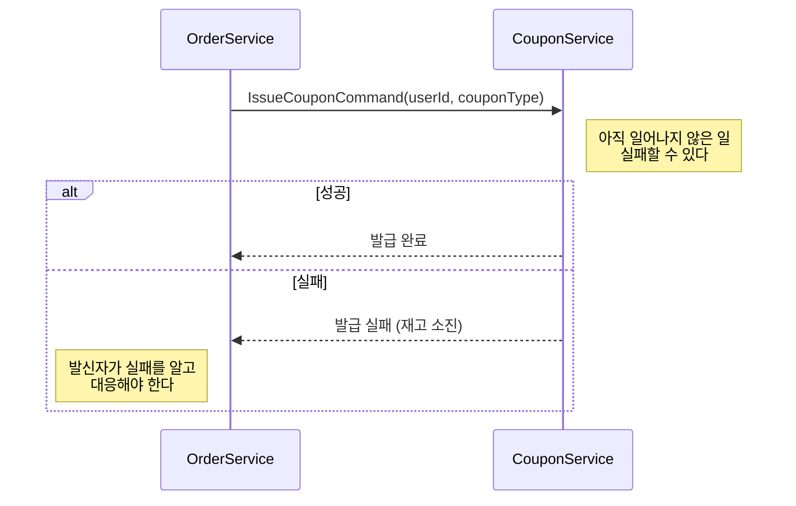
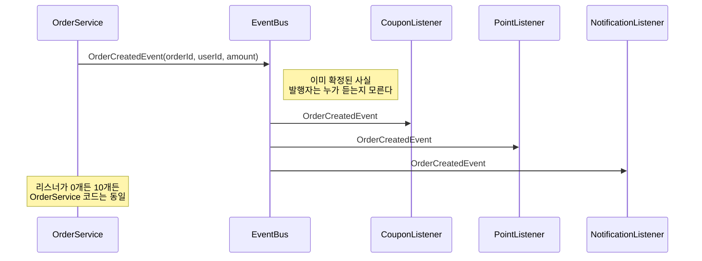

# Step 0 - Command vs Event

> 같은 메시지 인프라를 쓰더라도, 안에 담기는 것의 **의미**가 다르면 Consumer의 책임이 완전히 달라진다.

---

## 학습 목표

- Command와 Event의 본질적 차이를 구분한다
- 같은 인프라라도 담기는 내용에 따라 설계가 달라짐을 이해한다

## 핵심 구분

| 구분 | Command | Event |
|------|---------|-------|
| 의미 | "~해라" (아직 일어나지 않은 일) | "~되었다" (이미 확정된 사실) |
| 시제 | 미래/명령 | 과거/완료 |
| 실패 | 실패할 수 있다 | 이미 일어났으므로 실패 개념 없음 |
| 방향 | 1:1 (발신자가 수신자를 안다) | 1:N (발행자는 누가 듣는지 모른다) |
| 결합도 | 높음 (수신자에 의존) | 낮음 (발행자는 독립적) |
| 예시 | IssueCouponCommand | OrderCreatedEvent |

---

## 시퀀스 다이어그램

### Command 흐름: 1:1 지시

### Event 흐름: 1:N 통지

---

## 테스트 목록

| 테스트 클래스 | 메서드 | 증명하는 것 |
|---|---|---|
| CommandEventConceptTest | Command는_미래시제다_아직_일어나지_않은_일 | Command에는 occurredAt이 없다 |
| CommandEventConceptTest | Event는_과거시제다_이미_확정된_사실 | Event에는 항상 occurredAt이 있다 |
| CommandEventConceptTest | Command는_수신자를_특정한다_1대1 | 발신자가 handler를 직접 호출 |
| CommandEventConceptTest | Event는_수신자를_모른다_1대N | 리스너가 몇 개든 발행자 코드 동일 |
| CommandEventBehaviorTest | Command는_실패할_수_있고_발신자가_처리해야_한다 | 예외 발생 시 발신자 책임 |
| CommandEventBehaviorTest | Event는_이미_일어난_사실이므로_발행_자체는_실패하지_않는다 | 발행은 항상 성공 |
| CommandEventBehaviorTest | 같은_도메인에서_Command_실행_결과가_Event가_된다 | Command → 실행 → Event 흐름 |

## 학습 포인트

이 Step을 마치면 다음 질문에 답할 수 있어야 합니다:

- [ ] Command에는 왜 `occurredAt`이 없고, Event에는 왜 있는가?
- [ ] 같은 Kafka 토픽이라도 `coupon-issue-requests`와 `order-events`를 왜 다르게 설계해야 하는가?
- [ ] Event 발행자가 리스너 수를 몰라도 되는 이유는 무엇인가?
- [ ] "주문을 생성해라"와 "주문이 생성되었다"는 실패 처리 책임이 어떻게 다른가?

> 테스트를 실행한 뒤, `CommandEventBehaviorTest`의 마지막 테스트에서 Command 실행 결과가 Event가 되는 흐름을 따라가 보세요.

---

## 왜 먼저 다루는가

이걸 구분하지 않으면 Step 5에서 토픽을 설계할 때
`coupon-issue-requests`(Command)와 `order-events`(Event)를 같은 성격으로 취급하게 된다.

> 이 구분은 Step 3, Step 5에서 다시 돌아옵니다.
