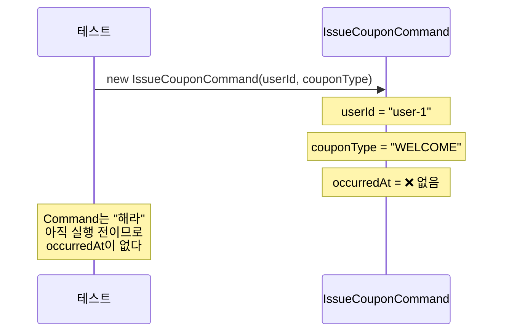
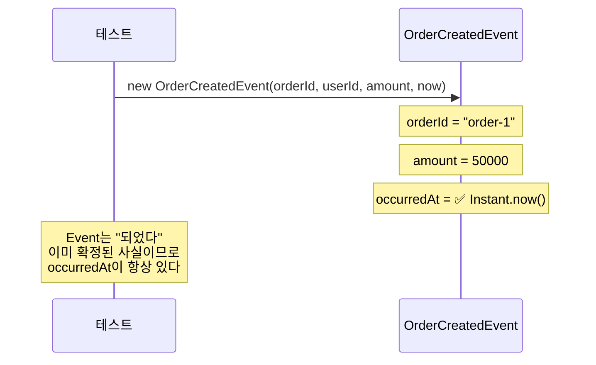
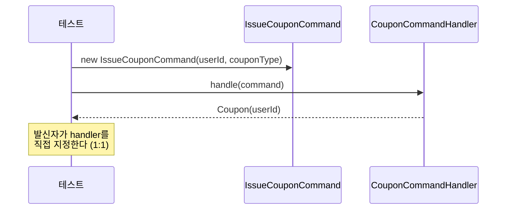
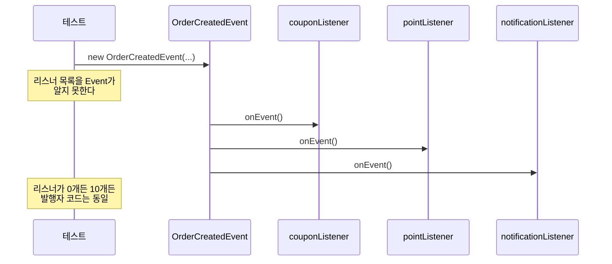
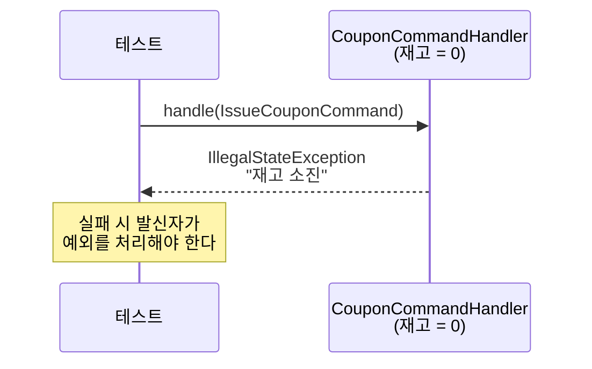
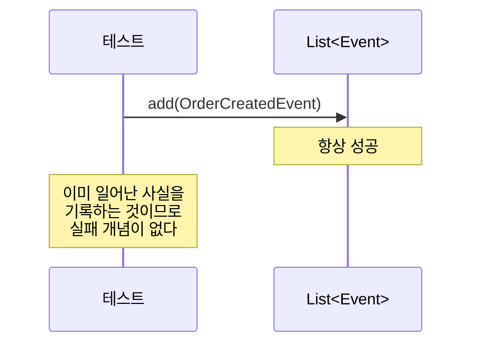
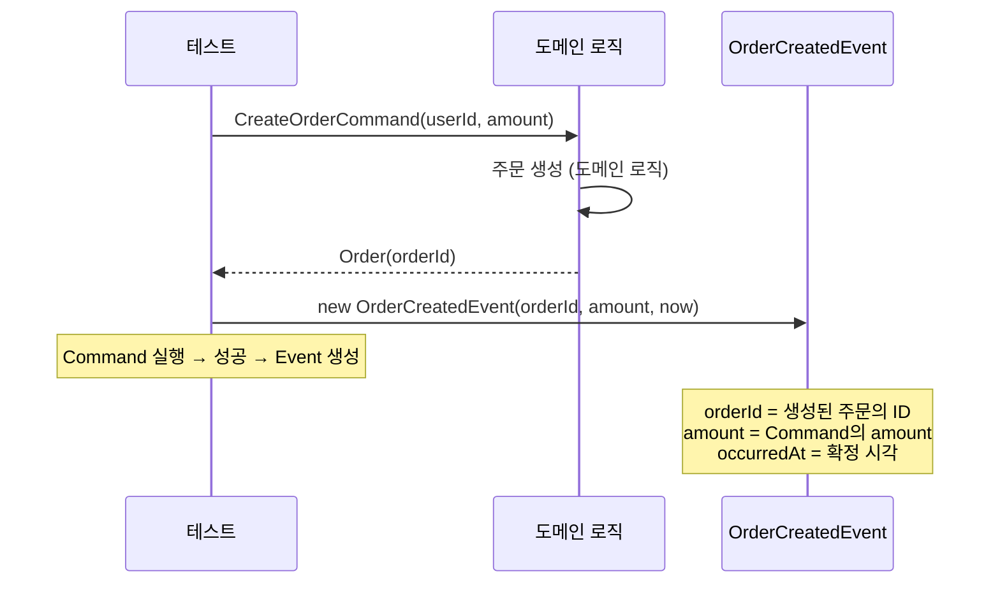

# Step 0 — Command vs Event 학습 테스트

Command와 Event의 구조적/행동적 차이를 순수 Java 객체로 확인한다.
Spring 컨텍스트 없이 실행되며, 개념이 인프라에 독립적임을 보여준다.

---

## CommandEventConceptTest

Command와 Event의 구조적 차이 — 시제, 방향, occurredAt 유무.

### Command는 미래시제다 — 아직 일어나지 않은 일

### Event는 과거시제다 — 이미 확정된 사실

### Command는 수신자를 특정한다 — 1:1

### Event는 수신자를 모른다 — 1:N

---

## CommandEventBehaviorTest

Command와 Event의 행동 차이 — 실패 가능성, 책임 소재, 그리고 Command → Event 흐름.

### Command는 실패할 수 있고 발신자가 처리해야 한다

### Event는 이미 일어난 사실이므로 발행 자체는 실패하지 않는다

### 같은 도메인에서 Command 실행 결과가 Event가 된다

---

## 학습 포인트

이 Step을 마치면 다음 질문에 답할 수 있어야 합니다:

- [ ] Command에는 왜 `occurredAt`이 없고, Event에는 왜 있는가?
- [ ] 같은 Kafka 토픽이라도 `coupon-issue-requests`와 `order-events`를 왜 다르게 설계해야 하는가?
- [ ] Event 발행자가 리스너 수를 몰라도 되는 이유는 무엇인가?
- [ ] "주문을 생성해라"와 "주문이 생성되었다"는 실패 처리 책임이 어떻게 다른가?

> 테스트를 실행한 뒤, `CommandEventBehaviorTest`의 마지막 테스트에서 Command 실행 결과가 Event가 되는 흐름을 따라가 보세요.

---

## 왜 먼저 다루는가

이걸 구분하지 않으면 Step 5에서 토픽을 설계할 때
`coupon-issue-requests`(Command)와 `order-events`(Event)를 같은 성격으로 취급하게 된다.

> 이 구분은 Step 3, Step 5에서 다시 돌아옵니다.
