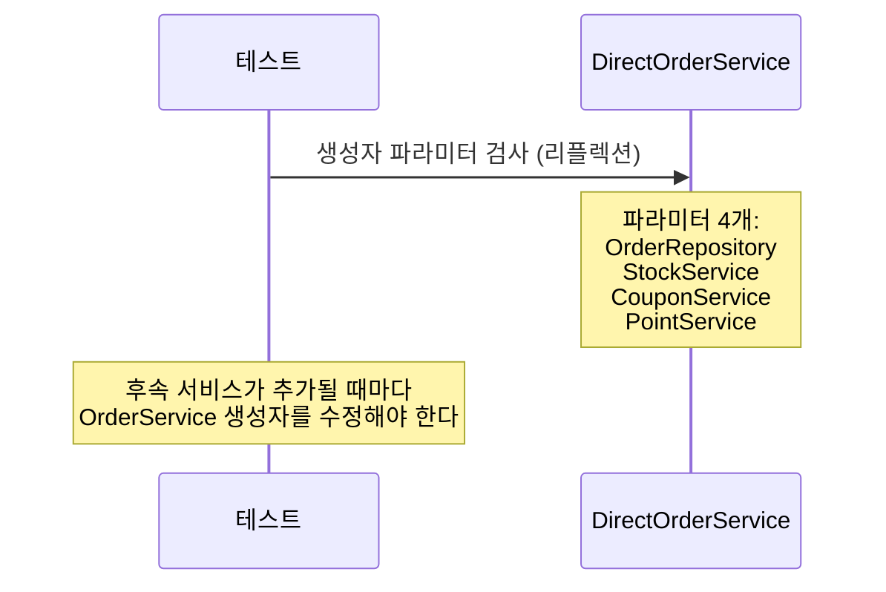
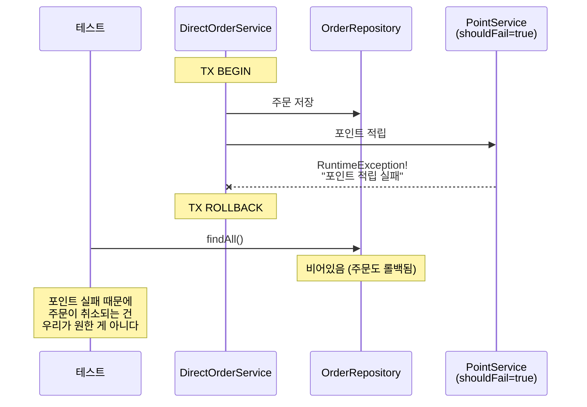
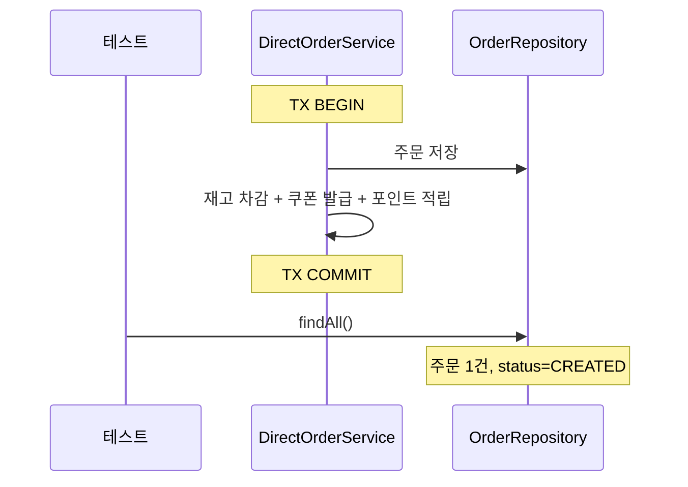
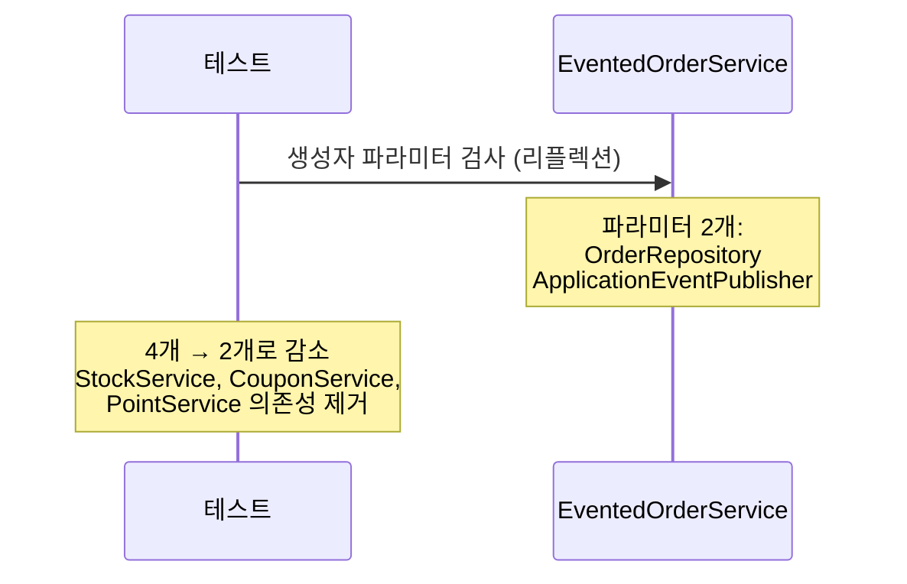
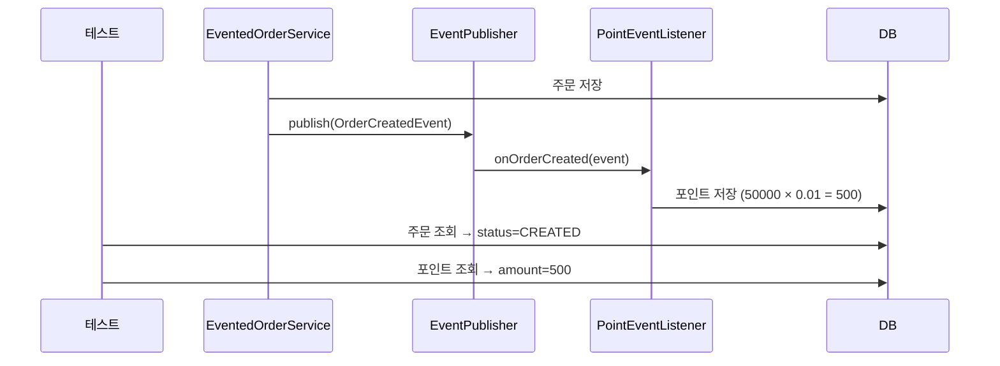
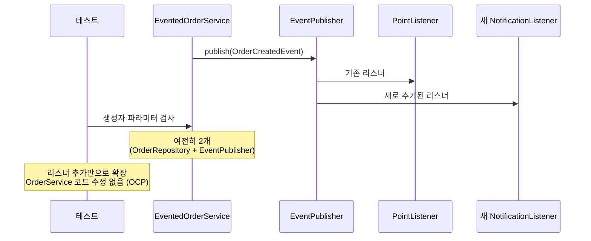
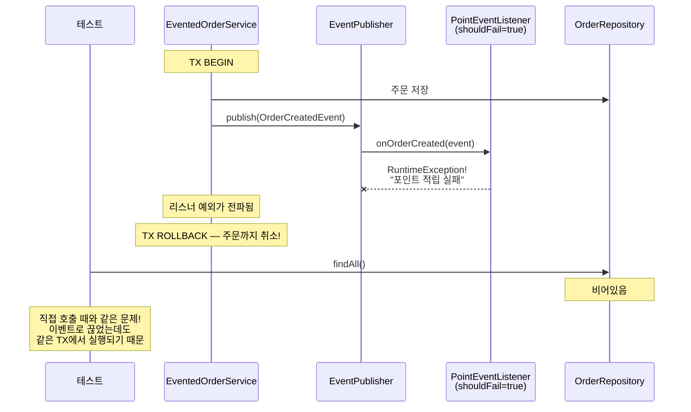
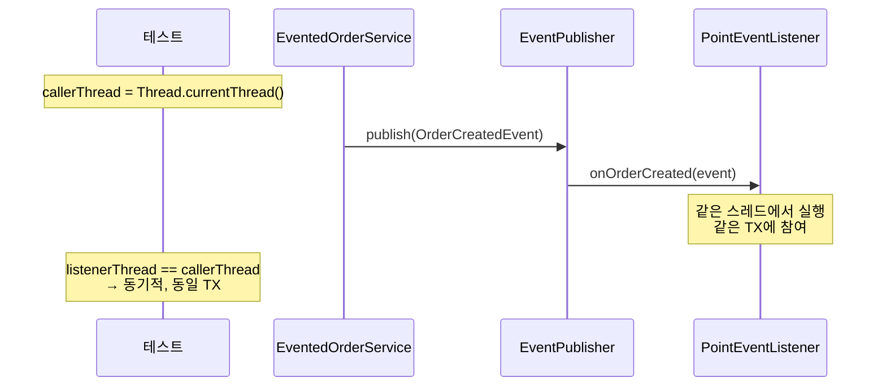

# Step 1 — Application Event 학습 테스트

직접 호출 방식의 결합도 문제를 체험하고,
ApplicationEventPublisher로 전환 후 의존성이 제거되는 것을 확인한다.
@EventListener 내부 예외가 발행자 트랜잭션을 롤백시키는 한계를 발견한다.

---

## DirectCallCouplingTest

직접 호출 방식의 결합도 문제 — 의존성 개수, 장애 전파, 정상 흐름.

### 직접 호출 방식에서 OrderService는 모든 후속 서비스에 의존한다

### 직접 호출 방식에서 후속 처리 실패시 주문도 롤백된다

### 직접 호출 방식에서 모든 후속 처리가 성공하면 주문이 완료된다

---

## ApplicationEventDecouplingTest

ApplicationEventPublisher로 전환 — 의존성 제거, OCP 달성.

### 이벤트 방식에서 OrderService는 EventPublisher에만 의존한다

### 이벤트 발행 후 리스너가 정상 처리하면 모든 데이터가 저장된다

### 후속 로직 추가시 OrderService는 수정하지 않아도 된다

---

## EventListenerExceptionTest

@EventListener의 핵심 한계 — 리스너 예외가 발행자 트랜잭션을 롤백시킨다.
이 한계가 Step 2로 넘어가는 동기가 된다.

### 리스너 예외가 발행자 트랜잭션을 롤백시킨다

### EventListener는 발행자와 같은 스레드에서 동기적으로 실행된다

---

## 학습 포인트

이 Step을 마치면 다음 질문에 답할 수 있어야 합니다:

- [ ] 직접 호출 방식에서 생성자 의존성이 4개인 이유는? (`DirectCallCouplingTest` 확인)
- [ ] 이벤트 방식으로 전환하면 의존성이 몇 개로 줄어드는가? 왜?
- [ ] 후속 로직(알림 서비스 등)을 추가할 때 OrderService를 수정해야 하는가?
- [ ] `@EventListener`에서 예외가 발생하면 왜 주문까지 롤백되는가? (같은 스레드, 같은 트랜잭션)

> `EventListenerExceptionTest`에서 `shouldFail = true`로 설정된 리스너가 발행자 TX를 어떻게 롤백시키는지 코드를 따라가 보세요.

---

## 체험할 한계 -> Step 2로

리스너에서 예외가 발생하면 주문 트랜잭션까지 롤백된다.
포인트 적립 실패 때문에 주문이 취소되는 건 우리가 원한 게 아니다.
