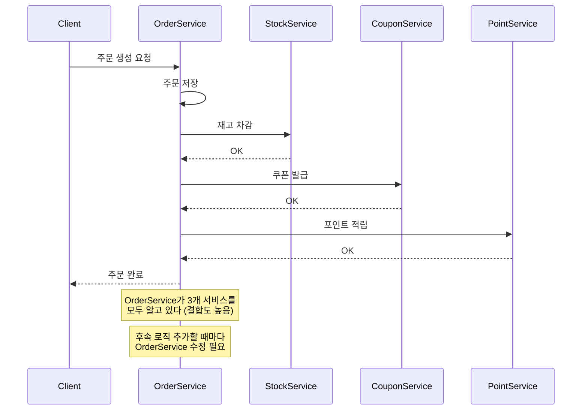
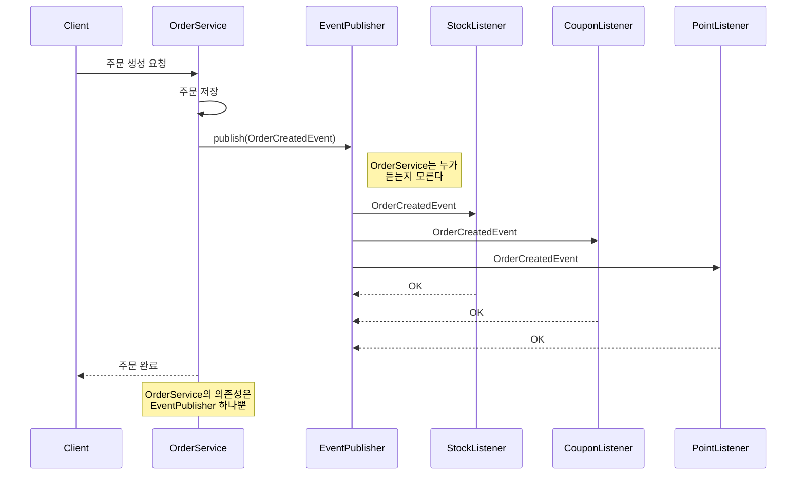
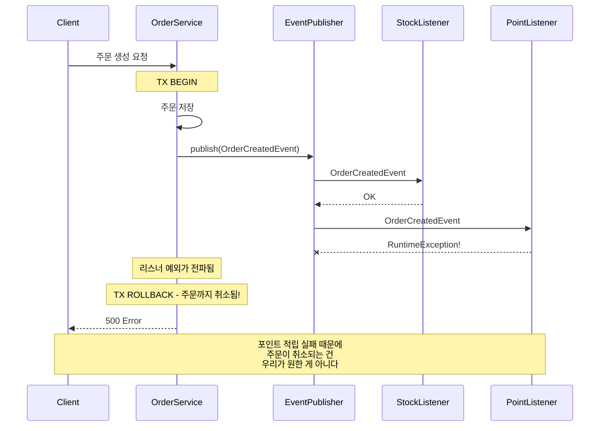

# Step 1 - Application Event

> 직접 호출을 이벤트로 끊으면, 발행자는 누가 듣는지 몰라도 된다.

---

## 학습 목표

- 직접 호출 방식의 결합도 문제를 체험한다
- ApplicationEventPublisher로 전환 후 의존성이 제거되는 걸 확인한다
- @EventListener 내부 예외가 발행자 트랜잭션을 롤백시키는 한계를 발견한다

---

## 시퀀스 다이어그램

### Before: 직접 호출 - 높은 결합도

### After: Application Event - 느슨한 결합

### Trap: 리스너 예외가 발행자를 롤백시킨다

---

## 테스트 목록

| 테스트 클래스 | 메서드 | 증명하는 것 |
|---|---|---|
| DirectCallCouplingTest | 직접_호출_방식에서_OrderService는_모든_후속_서비스에_의존한다 | 생성자 의존성 개수로 결합도 증명 |
| DirectCallCouplingTest | 직접_호출_방식에서_후속_처리_실패시_주문도_롤백된다 | 강한 결합의 부작용 |
| DirectCallCouplingTest | 직접_호출_방식에서_모든_후속_처리가_성공하면_주문이_완료된다 | 정상 흐름 |
| ApplicationEventDecouplingTest | 이벤트_방식에서_OrderService는_EventPublisher에만_의존한다 | 의존성 제거 확인 |
| ApplicationEventDecouplingTest | 이벤트_발행_후_리스너가_정상_처리하면_모든_데이터가_저장된다 | 정상 흐름 |
| ApplicationEventDecouplingTest | 후속_로직_추가시_OrderService는_수정하지_않아도_된다 | OCP 원칙 |
| EventListenerExceptionTest | 리스너_예외가_발행자_트랜잭션을_롤백시킨다 | 핵심 한계 발견 |
| EventListenerExceptionTest | EventListener는_발행자와_같은_스레드에서_동기적으로_실행된다 | 동일 TX 증명 |

## 체험할 한계 -> Step 2로

리스너에서 예외가 발생하면 주문 트랜잭션까지 롤백된다.
포인트 적립 실패 때문에 주문이 취소되는 건 우리가 원한 게 아니다.
