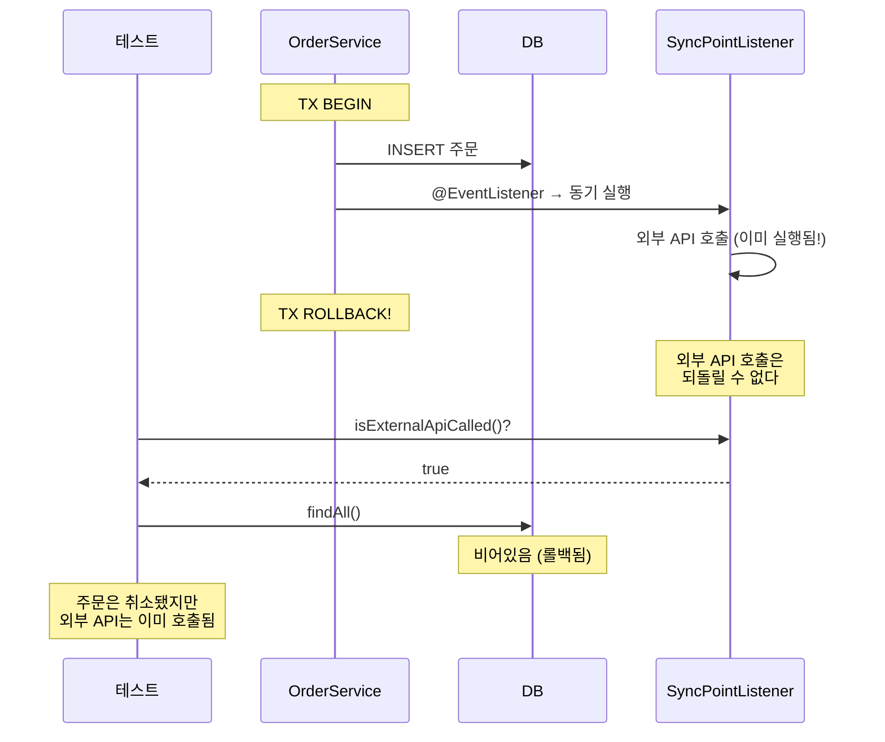
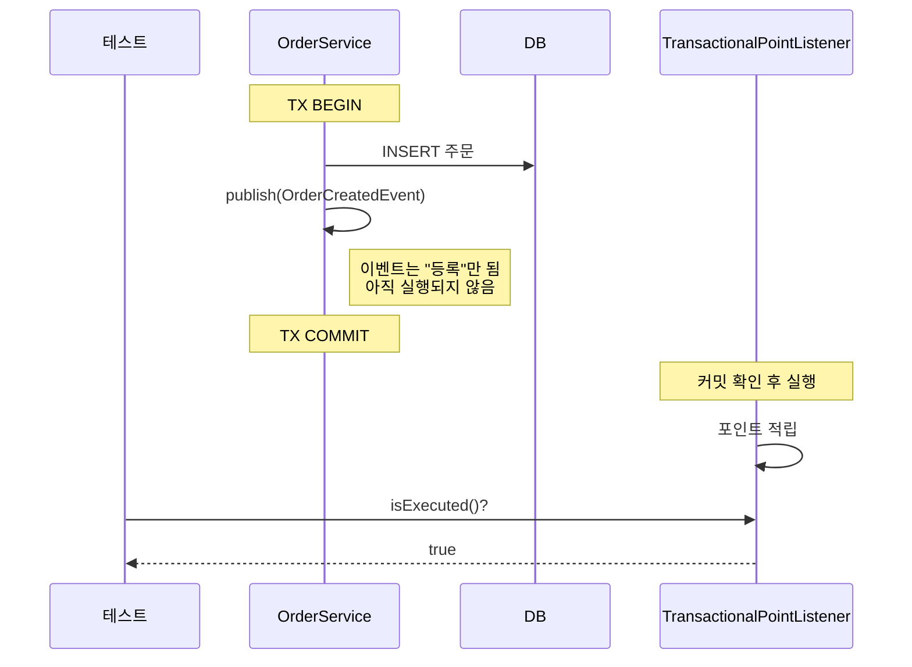
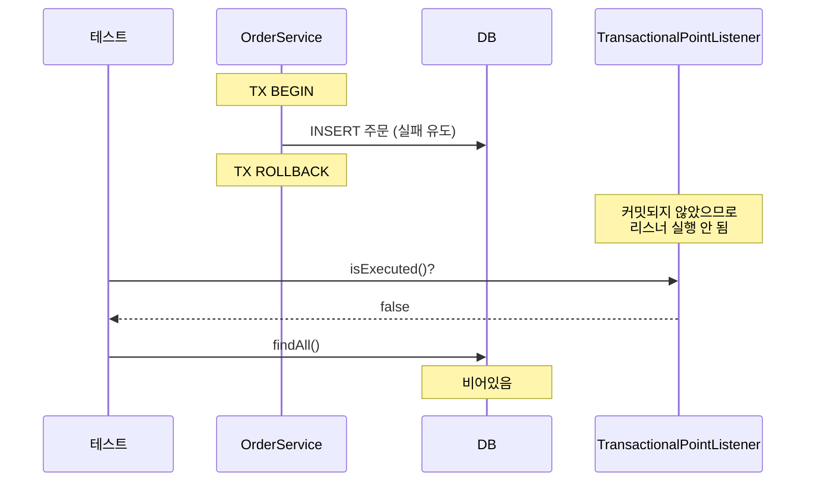
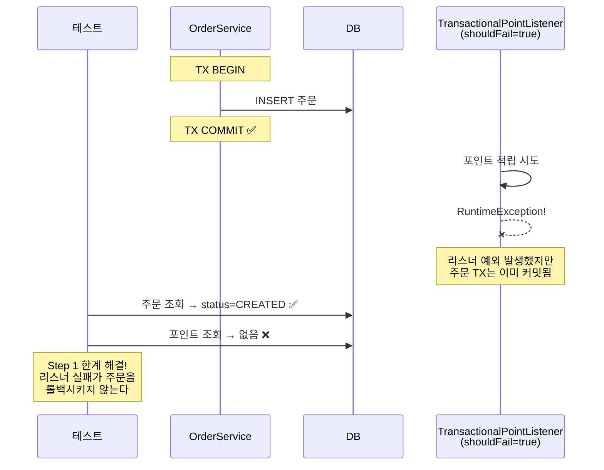
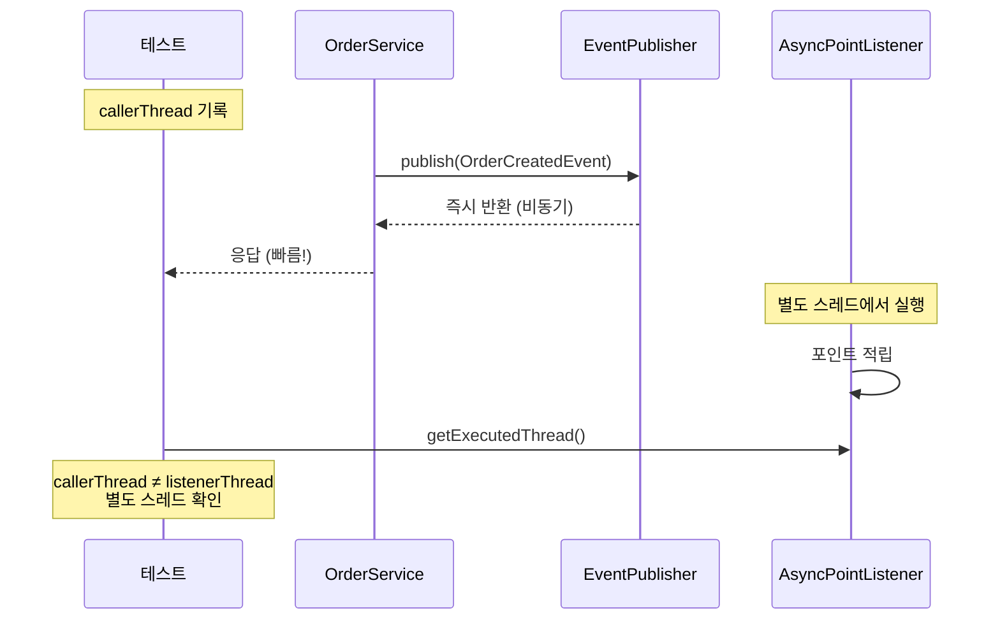
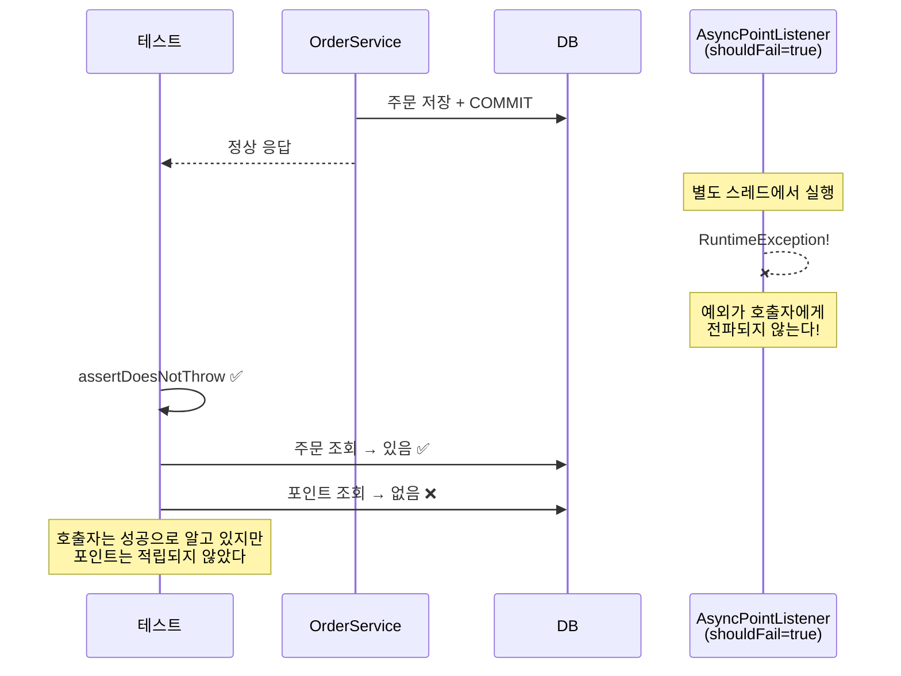
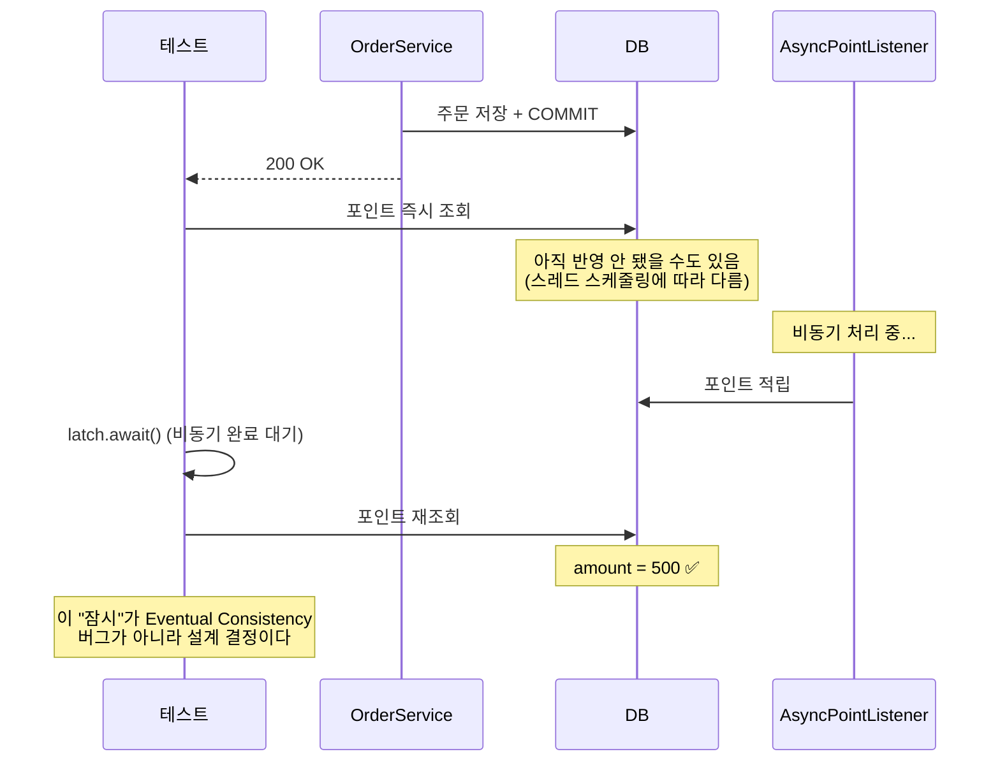
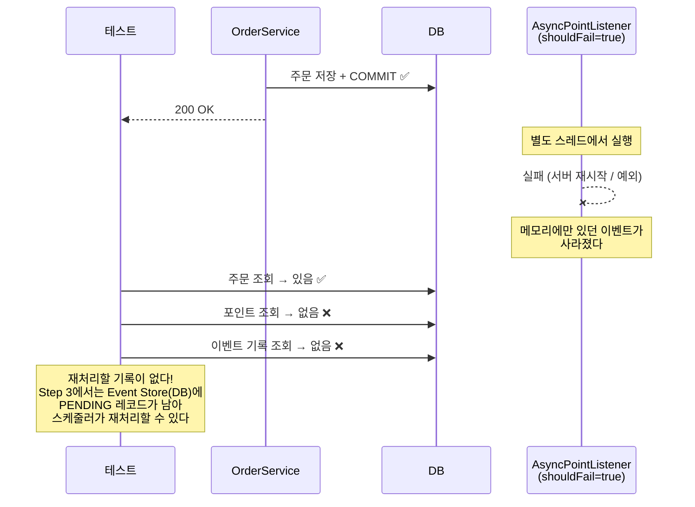

# Step 2 — Transactional Event 학습 테스트

트랜잭션 커밋 타이밍과 이벤트 실행 타이밍의 관계를 이해한다.
@Async의 편리함과 실패 은닉 문제를 동시에 체험한다.
AFTER_COMMIT + @Async를 선택한 순간, Eventual Consistency를 수용한 것이다.

---

## EventListenerTimingTest

@EventListener의 타이밍 위험 — 커밋 전에 실행되므로 롤백 시 부수효과가 되돌려지지 않는다.

### EventListener는 커밋 전에 실행되어 롤백시 부수효과가 되돌려지지 않는다

---

## TransactionalEventListenerTest

@TransactionalEventListener(AFTER_COMMIT)의 안전한 타이밍.
커밋 후에만 실행되므로 롤백 시 리스너가 실행되지 않는다.

### TransactionalEventListener는 커밋 후에만 실행된다

### 트랜잭션이 롤백되면 TransactionalEventListener는 실행되지 않는다

### TransactionalEventListener 예외는 발행자 트랜잭션에 영향을 주지 않는다

---

## AsyncEventTest

@Async의 편리함과 실패 은닉 문제.

### Async 리스너는 별도 스레드에서 실행되어 응답이 빠르다

### Async 리스너 예외는 호출자에게 전파되지 않는다 — 실패가 숨겨진다

---

## EventualConsistencyTest

Eventual Consistency 체험 — AFTER_COMMIT + @Async를 선택한 순간, 즉시 일관성은 포기한 것이다.

### 주문 직후 포인트를 조회하면 아직 반영되지 않았을 수 있다

> **코드 주석:** `assertThat(point).isEmpty()`로 단정하지 않는 이유 — 스레드 스케줄링에 따라 이미 반영되었을 수 있어 테스트가 불안정해진다. Eventual Consistency의 핵심은 "없을 수도 있다"이지 "항상 없다"가 아니다.

---

## AsyncEventLossTest

@Async 이벤트가 메모리에만 존재하므로, 서버가 죽으면 유실되는 한계.
이 한계가 Step 3(Event Store)으로 넘어가는 동기가 된다.

### 서버가 재시작되면 Async 리스너가 처리하지 못한 이벤트는 유실된다

---

## 학습 포인트

이 Step을 마치면 다음 질문에 답할 수 있어야 합니다:

- [ ] `@EventListener`와 `@TransactionalEventListener(AFTER_COMMIT)`의 실행 타이밍 차이는?
- [ ] AFTER_COMMIT 리스너에서 예외가 발생하면 주문 트랜잭션에 영향을 주는가? 왜?
- [ ] `@Async`를 붙이면 응답은 빨라지지만 무엇을 잃는가?
- [ ] 주문 직후 포인트를 조회하면 0이 나올 수 있다 — 이것은 버그인가, 설계 결정인가?
- [ ] 서버가 재시작되면 `@Async` 스레드의 이벤트는 어디로 가는가?

> `EventualConsistencyTest` 코드에서 `assertThat(point).isEmpty()`를 쓰지 않는 이유를 주석으로 확인해 보세요. 스레드 스케줄링에 따라 이미 반영되었을 수 있어 테스트가 불안정해지기 때문입니다.

---

## 이 Step에서 인식해야 할 것

AFTER_COMMIT + @Async를 선택한 이 순간, Eventual Consistency를 수용한 것이다.

## 체험할 한계 -> Step 3으로

@Async로 별도 스레드에서 도는 순간, 서버가 재시작되면 메모리의 이벤트는 증발한다.
