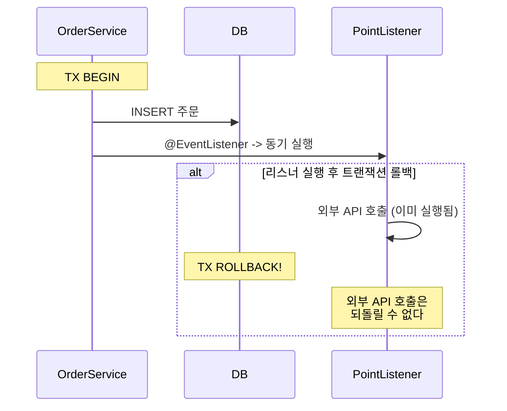
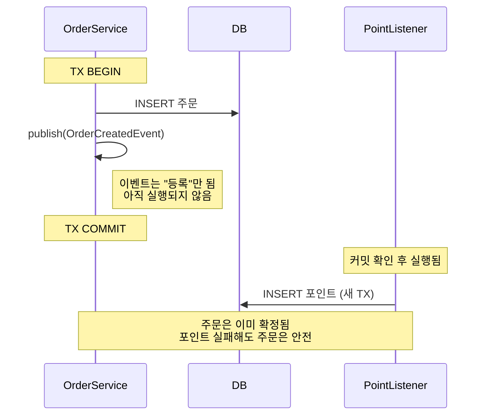
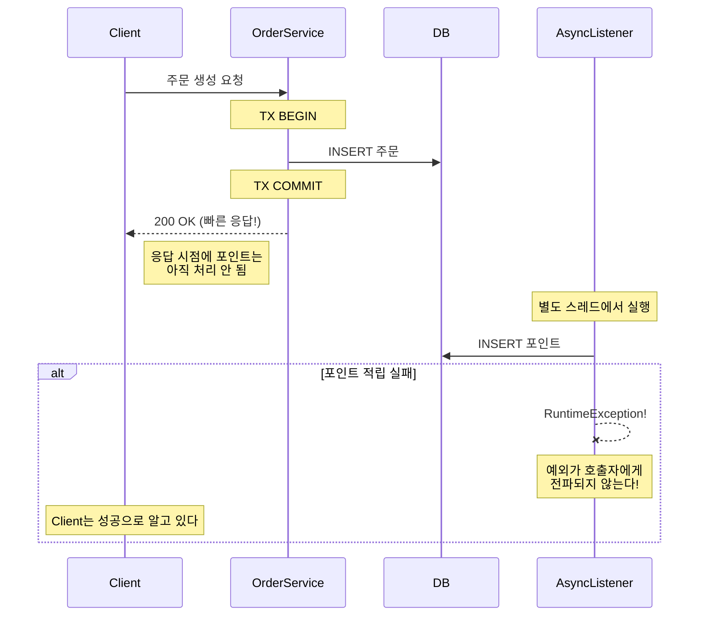
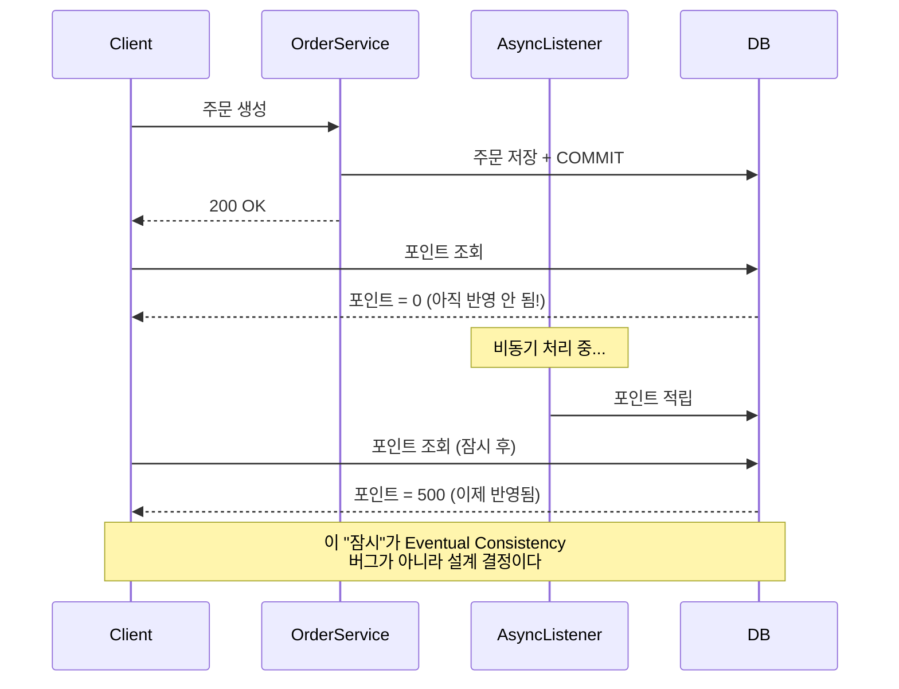

# Step 2 - Transactional Event + Eventual Consistency

> 트랜잭션이 확정된 이후에만 후속 처리를 실행해야 안전하다.
> 단, 이 선택을 한 순간 "즉시 일관성"은 포기한 것이다.

---

## 학습 목표

- 트랜잭션 커밋 타이밍과 이벤트 실행 타이밍의 관계를 이해한다
- @Async의 편리함과 실패 은닉 문제를 동시에 체험한다
- **Eventual Consistency를 수용한 것임을 인식한다**

---

## 시퀀스 다이어그램

### 위험: @EventListener는 커밋 전에 실행된다

### 안전: @TransactionalEventListener(AFTER_COMMIT)

### @Async: 빠르지만 실패가 보이지 않는다

### Eventual Consistency

---

## 테스트 목록

| 테스트 클래스 | 메서드 | 증명하는 것 |
|---|---|---|
| EventListenerTimingTest | EventListener는_커밋_전에_실행되어_롤백시_부수효과가_되돌려지지_않는다 | 타이밍 위험 |
| TransactionalEventListenerTest | TransactionalEventListener는_커밋_후에만_실행된다 | 안전한 타이밍 |
| TransactionalEventListenerTest | 트랜잭션이_롤백되면_TransactionalEventListener는_실행되지_않는다 | 롤백 안전 |
| TransactionalEventListenerTest | TransactionalEventListener_예외는_발행자_트랜잭션에_영향을_주지_않는다 | 주문 TX 보호 |
| AsyncEventTest | Async_리스너는_별도_스레드에서_실행되어_응답이_빠르다 | 비동기 응답 |
| AsyncEventTest | Async_리스너_예외는_호출자에게_전파되지_않는다_실패가_숨겨진다 | 실패 은닉 |
| EventualConsistencyTest | 주문_직후_포인트를_조회하면_아직_반영되지_않았을_수_있다 | Eventual Consistency |
| AsyncEventLossTest | 서버가_재시작되면_Async_리스너가_처리하지_못한_이벤트는_유실된다 | **핵심 한계: 메모리 휘발** |

## 학습 포인트

이 Step을 마치면 다음 질문에 답할 수 있어야 합니다:

- [ ] `@EventListener`와 `@TransactionalEventListener(AFTER_COMMIT)`의 실행 타이밍 차이는?
- [ ] AFTER_COMMIT 리스너에서 예외가 발생하면 주문 트랜잭션에 영향을 주는가? 왜?
- [ ] `@Async`를 붙이면 응답은 빨라지지만 무엇을 잃는가?
- [ ] 주문 직후 포인트를 조회하면 0이 나올 수 있다 — 이것은 버그인가, 설계 결정인가?
- [ ] 서버가 재시작되면 `@Async` 스레드의 이벤트는 어디로 가는가?

> `EventualConsistencyTest` 코드에서 `assertThat(point).isEmpty()`를 쓰지 않는 이유를 주석으로 확인해 보세요. 스레드 스케줄링에 따라 이미 반영되었을 수 있어 테스트가 불안정해지기 때문입니다.

---

## 이 Step에서 인식해야 할 것

AFTER_COMMIT + @Async를 선택한 이 순간, Eventual Consistency를 수용한 것이다.

## 체험할 한계 -> Step 3으로

@Async로 별도 스레드에서 도는 순간, 서버가 재시작되면 메모리의 이벤트는 증발한다.
