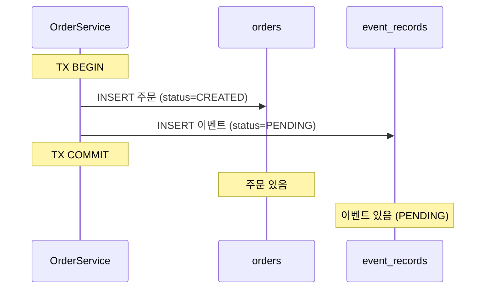
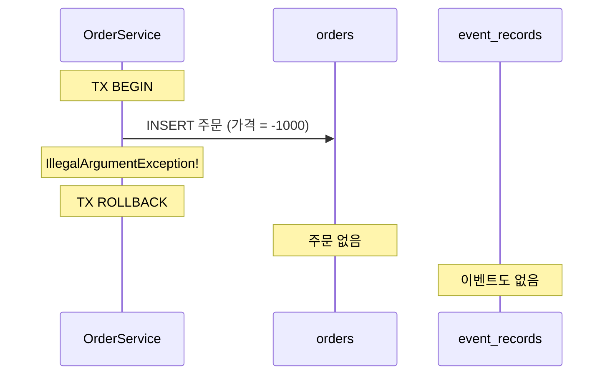
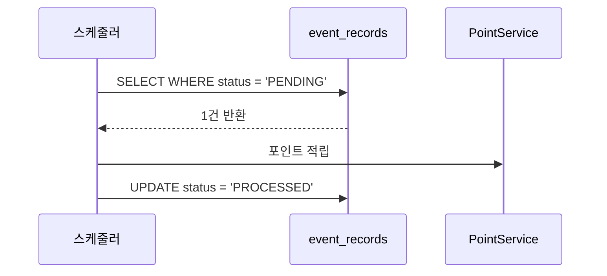
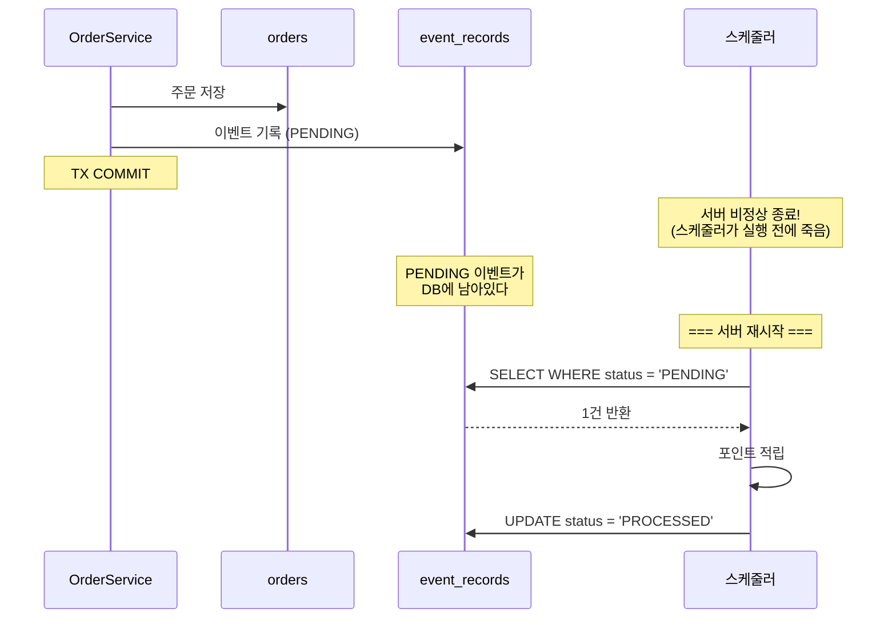
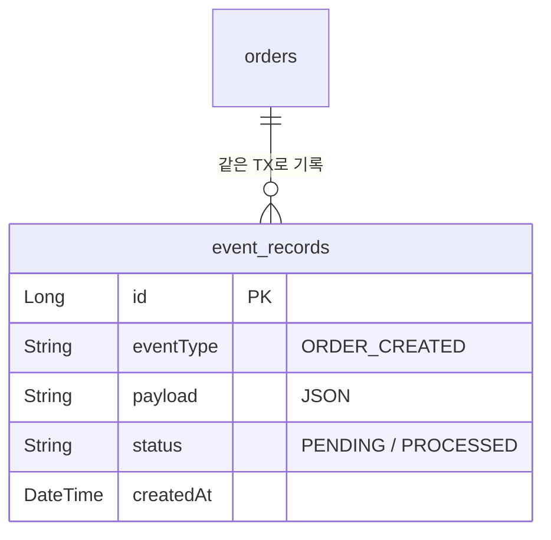

# Step 3 — Event Store

---

## Step 2의 한계에서 시작하자

Step 2에서 AFTER_COMMIT + @Async로 안전한 타이밍과 빠른 응답을 확보했다. graceful shutdown으로 정상 배포 시 이벤트 유실도 방어할 수 있었다.

근데 한 가지 근본적인 문제가 남았다.

```
서버가 비정상 종료되면 (kill -9, OOM, 크래시)
→ 메모리에만 있던 이벤트가 사라진다
→ DB에 기록이 없다
→ 재처리할 방법이 없다
```

주문은 DB에 저장됐다. 근데 "주문이 생성되었다"는 이벤트는 메모리에만 있었다. 서버가 죽으면 이벤트가 증발하고, 포인트는 영영 적립되지 않는다. **고객이 문의하기 전까지 아무도 모른다.**

해결 방법은 단순하다. **이벤트도 DB에 저장하면 된다.**

---

## 핵심 아이디어 — 도메인 저장과 이벤트 기록을 같은 트랜잭션으로

주문을 저장할 때, 이벤트도 **같은 트랜잭션 안에서** DB에 기록한다.

```java
@Transactional
void createOrder(CreateOrderCommand cmd) {
    // 1. 도메인 저장
    Order order = orderRepository.save(Order.create(cmd));

    // 2. 이벤트 기록 (같은 TX!)
    eventRecordRepository.save(EventRecord.create(
            "ORDER_CREATED",
            toJson(OrderCreatedEvent.from(order)),
            EventStatus.PENDING
    ));
}
```



> **EventStoreAtomicityTest** — `주문_저장과_이벤트_기록은_하나의_트랜잭션으로_묶인다()`에서 확인.

왜 **같은 트랜잭션**이어야 하는가?

따로 하면 이런 일이 생긴다.

```
TX1: 주문 저장 → COMMIT
— 여기서 서버가 죽으면? —
TX2: 이벤트 기록 → 실행 안 됨
→ 주문은 있는데 이벤트 기록은 없다
→ 재처리할 방법이 없다 (Step 2와 같은 문제)
```

같은 트랜잭션이면 **둘 다 성공하거나, 둘 다 실패한다.**



> **EventStoreAtomicityTest** — `주문_저장이_실패하면_이벤트_기록도_함께_롤백된다()`에서 확인.

주문이 성공했으면 이벤트 기록도 반드시 있다. 주문이 실패했으면 이벤트 기록도 없다. **원자성.**

---

## 스케줄러가 PENDING 이벤트를 처리한다

이벤트가 DB에 PENDING 상태로 저장됐다. 이제 누군가가 이걸 처리해야 한다.

**스케줄러(릴레이)**가 주기적으로 PENDING 이벤트를 조회해서 처리한다.



```java
void processEvents() {
    List<EventRecord> pending = eventRecordRepository.findByStatus(PENDING);
    for (EventRecord record : pending) {
        // 이벤트 처리 (포인트 적립, 알림 발송 등)
        handle(record);
        // 상태 전이
        record.markAsProcessed();
    }
}
```

> **EventRelayTest** — `스케줄러는_PENDING_상태의_이벤트를_조회하여_처리한다()`에서 확인.

처리가 끝나면 상태가 PENDING → PROCESSED로 바뀐다.

> **EventRelayTest** — `처리_완료된_이벤트는_PROCESSED_상태로_변경된다()`에서 확인.

그리고 PROCESSED 상태인 이벤트는 다시 처리되지 않는다. 스케줄러가 두 번 돌아도 중복 적립이 안 된다.

> **EventRelayTest** — `이미_처리된_이벤트는_다시_처리하지_않는다()`에서 확인.

---

## 그래서 서버가 죽으면 어떻게 되는가

이제 Step 2에서 해결 못 했던 시나리오를 다시 보자.



Step 2에서는 이벤트가 메모리에만 있었기 때문에 서버가 죽으면 증발했다. **여기서는 DB에 PENDING으로 남아있다.** 서버가 살아나면 스케줄러가 PENDING을 조회해서 재처리한다.

> **EventStoreRecoveryTest** — `서버_재시작_후에도_PENDING_이벤트는_DB에_남아있다()`에서 확인.
> **EventStoreRecoveryTest** — `재시작_후_스케줄러가_PENDING_이벤트를_재처리한다()`에서 확인.

이게 Event Store의 핵심 가치다. **"메모리가 아니라 DB에 기록하니까, 서버가 죽어도 재처리할 수 있다."**

---

## Event Store 테이블은 이렇게 생겼다

```
event_records
├── id (PK)
├── event_type      "ORDER_CREATED"
├── payload         JSON (orderId, amount, userId ...)
├── status          PENDING → PROCESSED
└── created_at      이벤트 생성 시각
```



`status`가 이 테이블의 핵심이다. PENDING은 "아직 처리 안 됨", PROCESSED는 "처리 완료". 스케줄러는 PENDING만 조회하니까 이미 처리된 건 다시 안 건드린다.

여기서 중요한 관점 전환이 하나 있다. 지금까지는 "트랜잭션으로 원자성을 보장한다"에 집중했다. 근데 Event Store부터는 **"상태 전이를 설계한다"**가 더 중요해진다. PENDING → PROCESSED라는 상태 전이가 "이 이벤트가 처리됐는가?"를 추적하는 유일한 수단이다.

나중에 서비스가 분리되면 "하나의 TX로 전부 묶는" 것이 불가능해진다. 그때는 상태 전이(PENDING → SENT → CONSUMED → PROCESSED)와 보상(실패 시 어떻게 원복하는가)이 트랜잭션을 대체한다. 이 Step의 `status` 컬럼이 그 출발점이다.

---

## 잠깐 — 여기까지면 충분한 경우도 있다

모놀리식 애플리케이션에서 후속 처리(포인트 적립, 알림 발송)가 **같은 프로세스 안에서** 이뤄진다면, Event Store + 스케줄러만으로 충분할 수 있다.

```
주문 서비스 (모놀리식)
├── OrderService → event_records에 PENDING 기록
├── 스케줄러 → PENDING 조회 → PointService 호출 → PROCESSED
└── 전부 같은 프로세스, 같은 DB
```

이벤트 유실도 없고, 재처리도 되고, 구조도 단순하다. **Kafka 없이도 된다.**

그러면 **언제 Kafka가 필요해지는가?**

```
1. 포인트 서비스를 별도 팀이 독립 배포하게 되면
   → ApplicationEvent는 프로세스 경계를 넘지 못한다

2. 정산 시스템, 분석 시스템이 같은 이벤트를 소비해야 하면
   → 각 시스템이 독립적으로, 자기 속도로 소비해야 한다

3. 이벤트 핸들러가 무거운 작업을 해서 리소스 경합이 생기면
   → 같은 프로세스에서 비즈니스 요청과 DB 커넥션을 나눠 쓰게 된다
```

이 중 하나라도 해당되면 프로세스 밖으로 이벤트를 보내야 한다. 그게 Step 4(Redis Pub/Sub)와 Step 5(Kafka)다.

---

## 그리고 이 Event Store가 나중에 Outbox가 된다

지금은 스케줄러가 PENDING 이벤트를 조회해서 **같은 프로세스 안에서** 처리한다.

Step 5에서는 스케줄러가 PENDING 이벤트를 조회해서 **Kafka로 발행**한다.

```
지금 (Step 3):
  스케줄러 → PENDING 조회 → PointService.record() → PROCESSED

Step 5:
  스케줄러 → PENDING 조회 → Kafka.send() → SENT
  Kafka Consumer → 포인트 적립
```

이 두 가지를 합치면 **Transactional Outbox Pattern**이 된다.

```
도메인 저장 + 이벤트 기록 (같은 TX)  ← Step 3에서 한 것
릴레이가 이벤트를 Kafka로 발행        ← Step 5에서 할 것
합치면 = Transactional Outbox
```

지금 만든 Event Store가 그대로 Outbox 테이블이 된다. **새로운 개념이 아니라, 이미 만든 것의 확장이다.**

---

## 스스로 답해보자

- 주문 저장과 이벤트 기록을 왜 같은 트랜잭션으로 묶어야 하는가? 따로 하면 어떤 일이 생기는가?
- 주문 저장은 성공했는데 이벤트 기록이 실패하면? (원자성이 없는 경우)
- 스케줄러가 2번 돌면 포인트가 2번 적립되는가? 왜 안 되는가?
- Step 2에서는 서버가 죽으면 이벤트가 증발했는데, 여기서는 왜 살아있는가?
- 모놀리식에서 Event Store + 스케줄러만으로 충분한 상황은 어떤 경우인가?
- 이 Event Store가 Step 5에서 어떻게 Outbox 테이블이 되는가?

> 답이 바로 나오면 Step 4로 넘어가자.
> 막히면 `EventStoreAtomicityTest`, `EventRelayTest`, `EventStoreRecoveryTest`를 실행해서 확인하자.

---

## 다음 Step으로

Event Store로 이벤트 유실을 해결했다.
하지만 스케줄러가 처리하는 것도, PointService를 호출하는 것도, 전부 **같은 프로세스 안**이다.

다른 시스템에 이벤트를 전달하려면 **프로세스 경계를 넘어야 한다.**
Step 4에서 Redis Pub/Sub로 프로세스 밖으로 이벤트를 보내본다.
근데 거기서 **메시지가 저장되지 않는다는** 새로운 한계를 만난다.