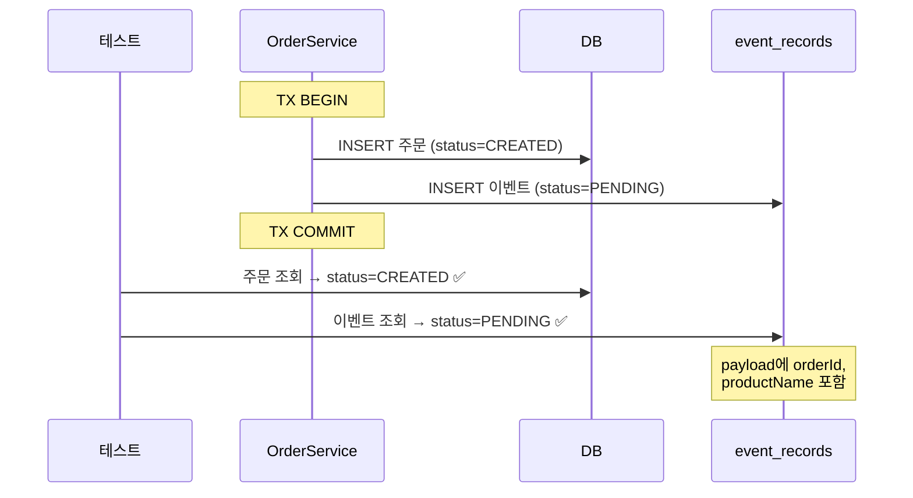
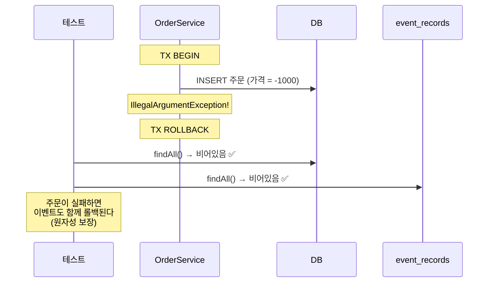
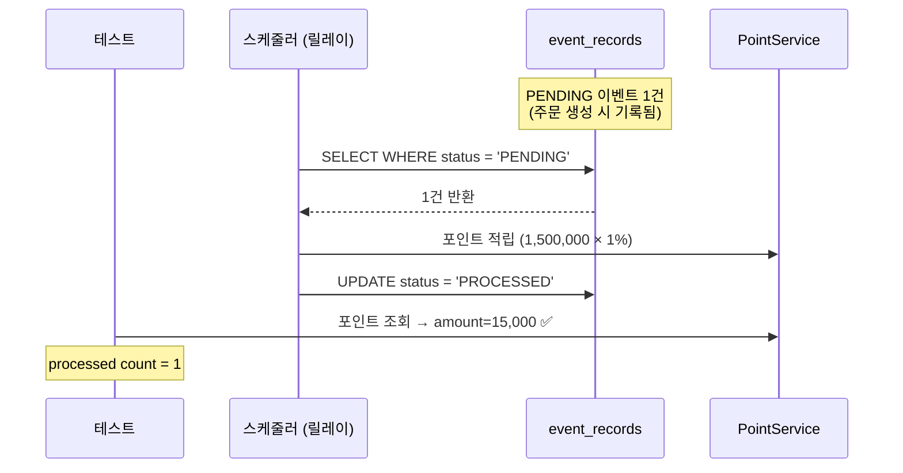
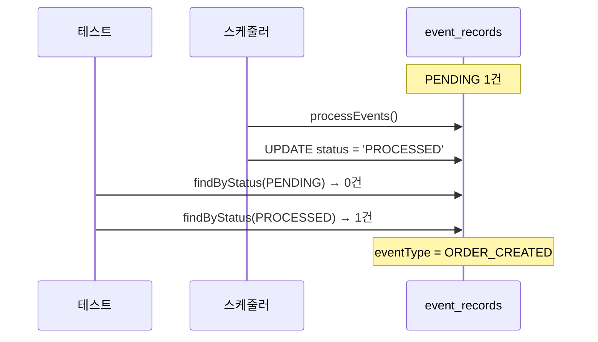
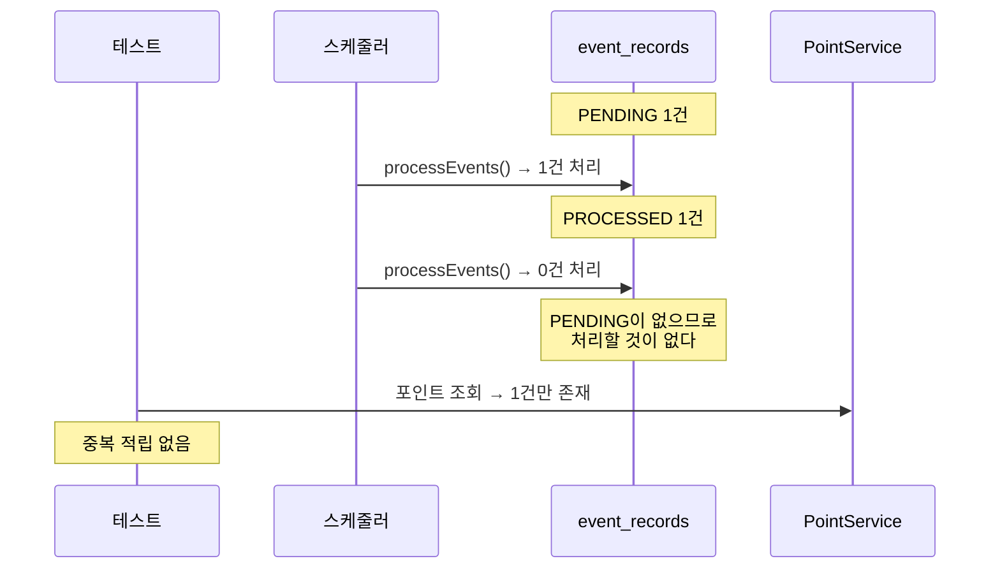
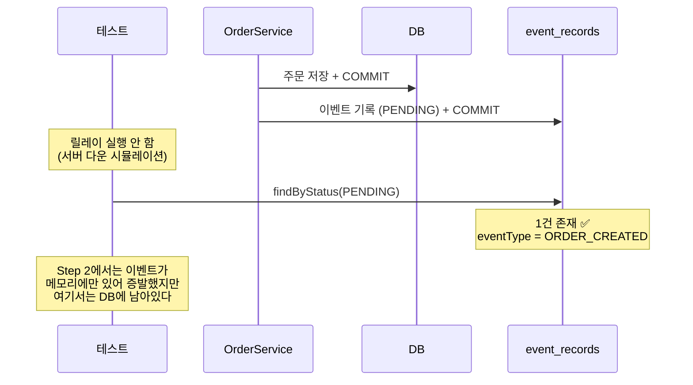
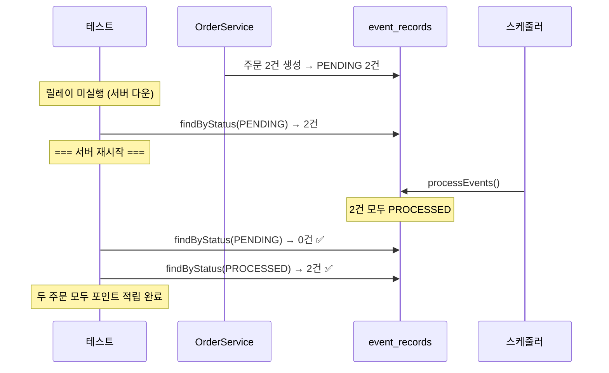
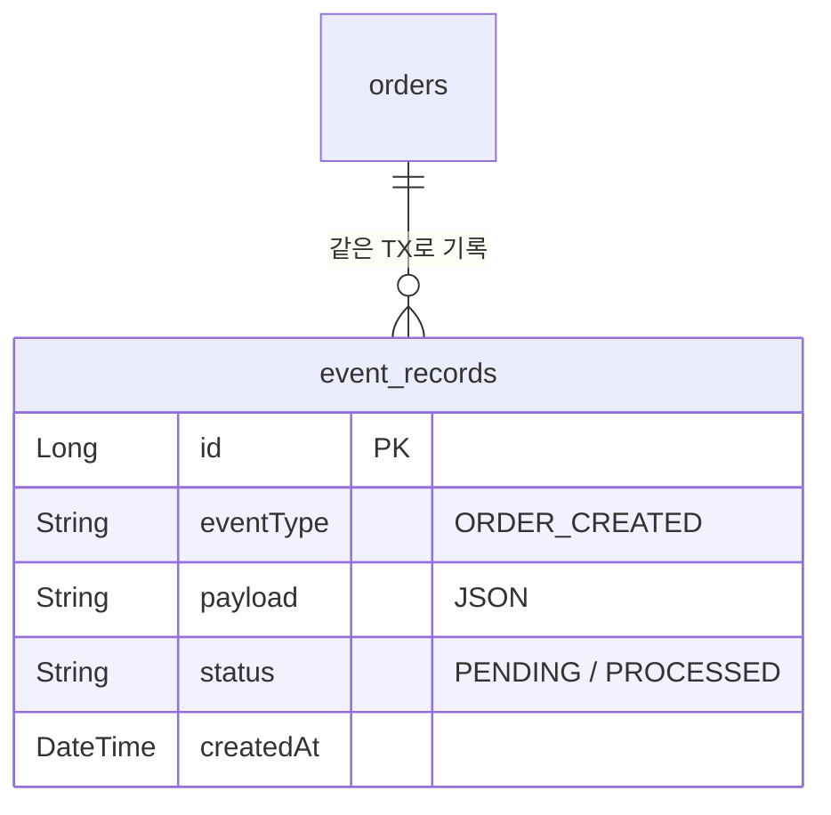

# Step 3 — Event Store 학습 테스트

도메인 저장과 이벤트 기록의 원자성을 검증한다.
스케줄러(릴레이)가 PENDING 이벤트를 처리하는 흐름을 확인한다.
서버 재시작 후에도 DB에 남아있는 이벤트를 재처리할 수 있음을 증명한다.

---

## EventStoreAtomicityTest

도메인 저장과 이벤트 기록의 원자성 — 둘 다 성공하거나, 둘 다 실패해야 한다.

### 주문 저장과 이벤트 기록은 하나의 트랜잭션으로 묶인다

### 주문 저장이 실패하면 이벤트 기록도 함께 롤백된다

---

## EventRelayTest

스케줄러(릴레이)가 PENDING 이벤트를 처리하는 흐름.

### 스케줄러는 PENDING 상태의 이벤트를 조회하여 처리한다

### 처리 완료된 이벤트는 PROCESSED 상태로 변경된다

### 이미 처리된 이벤트는 다시 처리하지 않는다

---

## EventStoreRecoveryTest

서버 재시작 후에도 PENDING 이벤트가 DB에 남아있어서 재처리 가능.

### 서버 재시작 후에도 PENDING 이벤트는 DB에 남아있다

### 재시작 후 스케줄러가 PENDING 이벤트를 재처리한다

---

## Event Store 테이블 구조

---

## 학습 포인트

이 Step을 마치면 다음 질문에 답할 수 있어야 합니다:

- [ ] 주문 저장과 이벤트 기록이 왜 같은 트랜잭션이어야 하는가? 따로 하면 어떤 일이 생기는가?
- [ ] 주문 저장은 성공했는데 이벤트 기록이 실패하면? (원자성이 없는 경우)
- [ ] 스케줄러(릴레이)는 어떤 기준으로 이벤트를 조회하는가?
- [ ] 서버가 죽었다 살아나면, Step 2에서는 이벤트가 증발했는데 여기서는 왜 살아있는가?

> `EventStoreRecoveryTest`에서 "서버 재시작"을 시뮬레이션하는 방식을 확인해 보세요. 실제로 프로세스를 죽이는 게 아니라 DB에 남아있는 PENDING 레코드를 이용합니다.

---

## 이 Step은 아직 완성형이 아니다

Event Store를 같은 서버의 스케줄러가 처리하므로 **단일 프로세스 한계가 여전합니다.**
다른 시스템(정산, 알림, 분석)에도 이벤트를 보내야 한다면?

**Step 5에서 이 Event Store를 Kafka로 릴레이하면, Transactional Outbox Pattern이 완성됩니다.**

## 체험할 한계 -> Step 4로

단일 프로세스 안에서만 이벤트가 순환한다.
다른 서비스에 이벤트를 전달하려면 프로세스 경계를 넘어야 한다.
