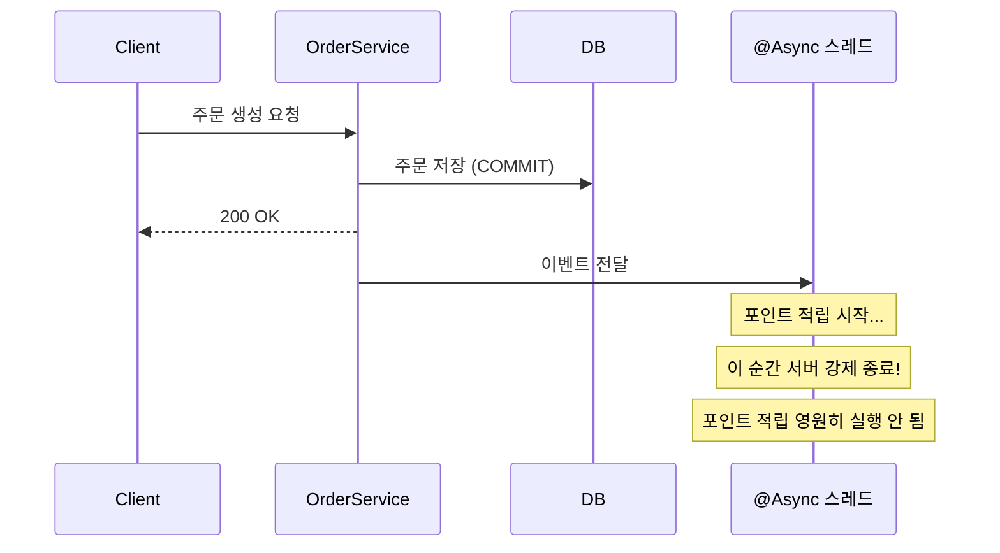
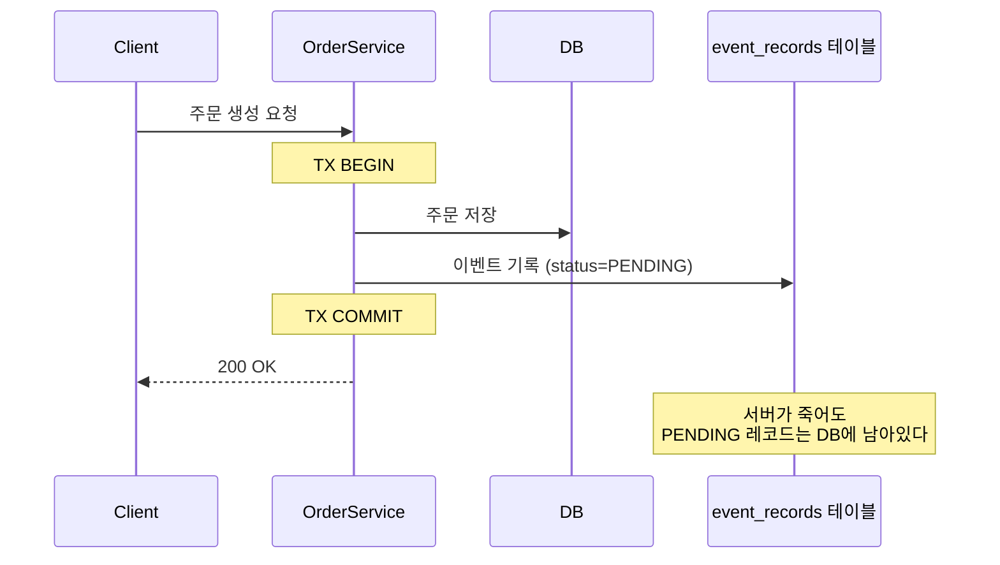
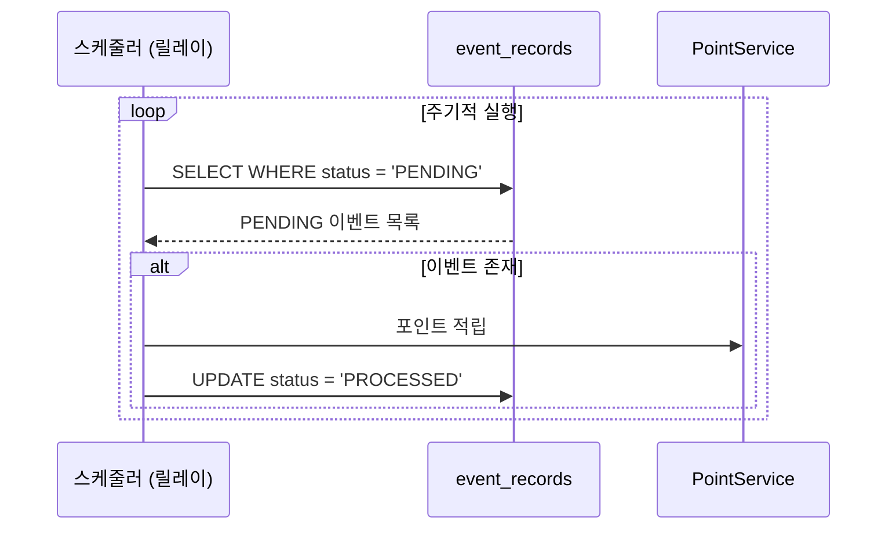
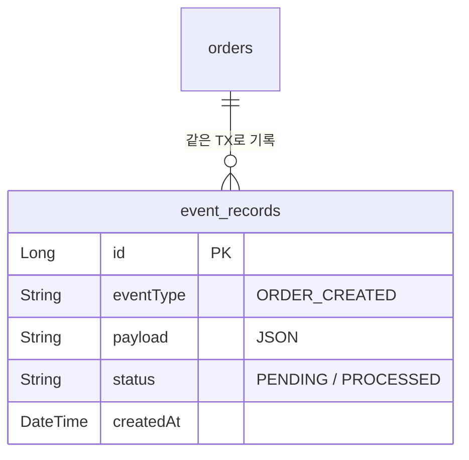

# Step 3 - Event Store

> 이벤트도 데이터다. DB에 같이 저장하면 서버가 죽어도 이벤트는 살아남는다.

---

## 이 Step에서 해결하는 문제

Step 2에서 `@Async + @TransactionalEventListener(AFTER_COMMIT)`를 사용했습니다.
서버가 살아있으면 잘 동작하지만, **비동기 처리 도중 서버가 죽으면 메모리의 이벤트는 증발합니다.**

## 해결 방법

도메인 데이터를 저장할 때 이벤트도 **같은 트랜잭션**으로 DB에 기록합니다.
스케줄러(릴레이)가 PENDING 이벤트를 주기적으로 읽어서 처리합니다.

---

## 시퀀스 다이어그램

### 문제: 비동기 이벤트 유실

### 해결: Event Store 기록

### 스케줄러 릴레이

### Event Store 테이블 구조

---

## 테스트 목록

| 테스트 클래스 | 메서드 | 증명하는 것 |
|---|---|---|
| EventStoreAtomicityTest | 주문_저장과_이벤트_기록은_하나의_트랜잭션으로_묶인다 | 원자성 (정상) |
| EventStoreAtomicityTest | 주문_저장이_실패하면_이벤트_기록도_함께_롤백된다 | 원자성 (실패) |
| EventRelayTest | 스케줄러는_PENDING_상태의_이벤트를_조회하여_처리한다 | 릴레이 동작 |
| EventRelayTest | 처리_완료된_이벤트는_PROCESSED_상태로_변경된다 | 상태 전이 |
| EventRelayTest | 이미_처리된_이벤트는_다시_처리하지_않는다 | 중복 방지 |
| EventStoreRecoveryTest | 서버_재시작_후에도_PENDING_이벤트는_DB에_남아있다 | 내구성 |
| EventStoreRecoveryTest | 재시작_후_스케줄러가_PENDING_이벤트를_재처리한다 | 복구 가능성 |

## 학습 포인트

이 Step을 마치면 다음 질문에 답할 수 있어야 합니다:

- [ ] 주문 저장과 이벤트 기록이 왜 같은 트랜잭션이어야 하는가? 따로 하면 어떤 일이 생기는가?
- [ ] 주문 저장은 성공했는데 이벤트 기록이 실패하면? (원자성이 없는 경우)
- [ ] 스케줄러(릴레이)는 어떤 기준으로 이벤트를 조회하는가?
- [ ] 서버가 죽었다 살아나면, Step 2에서는 이벤트가 증발했는데 여기서는 왜 살아있는가?

> `EventStoreRecoveryTest`에서 "서버 재시작"을 시뮬레이션하는 방식을 확인해 보세요. 실제로 프로세스를 죽이는 게 아니라 DB에 남아있는 PENDING 레코드를 이용합니다.

---

## 이 Step은 아직 완성형이 아니다

Event Store를 같은 서버의 스케줄러가 처리하므로 **단일 프로세스 한계가 여전합니다.**
다른 시스템(정산, 알림, 분석)에도 이벤트를 보내야 한다면?

**Step 5에서 이 Event Store를 Kafka로 릴레이하면, Transactional Outbox Pattern이 완성됩니다.**

## 체험할 한계 -> Step 4로

단일 프로세스 안에서만 이벤트가 순환한다.
다른 서비스에 이벤트를 전달하려면 프로세스 경계를 넘어야 한다.
