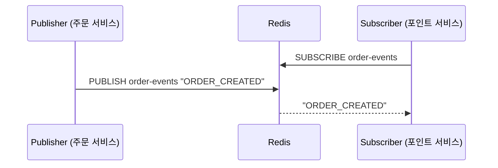
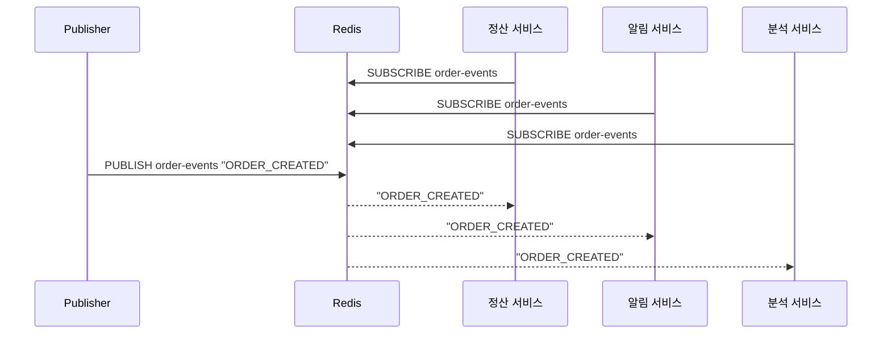
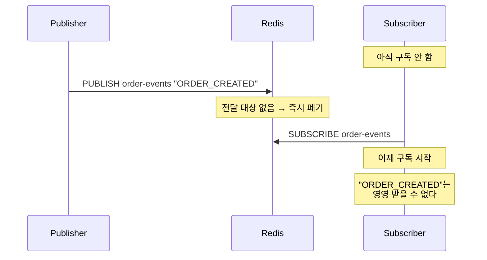
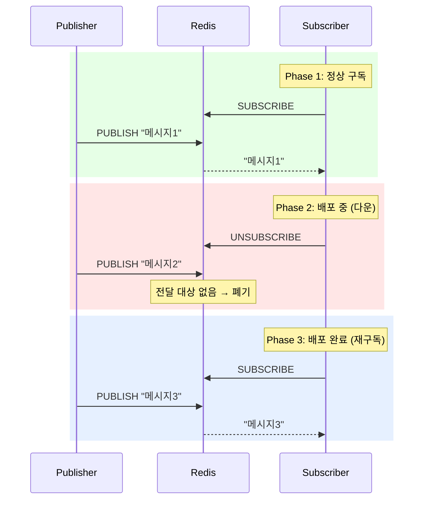

# Step 4 — Redis Pub/Sub

---

## Step 3의 한계에서 시작하자

Step 3에서 Event Store로 이벤트 유실을 해결했다. 서버가 죽어도 PENDING이 DB에 남아있고, 스케줄러가 재처리한다.

근데 전부 **같은 프로세스 안에서** 일어나는 일이다.

```
주문 서비스 (모놀리식)
├── OrderService → event_records에 PENDING 기록
├── 스케줄러 → PENDING 조회 → PointService 호출 → PROCESSED
└── 전부 같은 JVM, 같은 DB
```

포인트 서비스가 별도 시스템이면? 정산 시스템이 같은 이벤트를 소비해야 하면? 분석 시스템도? **ApplicationEvent는 프로세스 경계를 넘지 못한다.**

프로세스 밖으로 이벤트를 보내야 한다. 가장 단순한 방법부터 해보자. Redis Pub/Sub.

---

## 프로세스 밖으로 보내는 가장 단순한 방법

Redis Pub/Sub은 채널에 메시지를 발행하면, 그 채널을 구독하고 있는 모든 클라이언트가 메시지를 받는다. **다른 프로세스에서 돌고 있어도.**



프로세스가 달라도, 서버가 달라도, Redis를 통해 메시지가 전달된다. **프로세스 경계를 넘었다.**

> **RedisPubSubBasicTest** — `발행한_메시지를_구독자가_수신한다()`에서 확인.

그리고 구독자가 여러 개여도 **전부 같은 메시지를 받는다.** 브로드캐스트다.



> **RedisPubSubBroadcastTest** — `여러_구독자가_동일한_메시지를_모두_수신한다()`에서 확인.

좋다. 프로세스 밖으로 보내는 것도 되고, 여러 시스템이 동시에 받는 것도 된다.

**그런데.**

---

## 구독자가 없으면 메시지는 사라진다

포인트 서비스가 아직 안 떠있는 상태에서 주문 이벤트를 발행하면?



> **RedisPubSubMessageLossTest** — `구독자가_없으면_발행된_메시지는_유실된다()`에서 확인.

Redis Pub/Sub은 **메시지를 저장하지 않는다.** 발행 시점에 구독하고 있는 클라이언트에게 전달하고, 전달할 대상이 없으면 버린다.

---

## 구독자가 잠깐 죽었다가 살아나면?

더 현실적인 시나리오를 보자. 포인트 서비스가 정상 운영 중이다가 배포 때문에 잠깐 내려갔다.



수신한 메시지: `["메시지1", "메시지3"]`. **"메시지2"는 영영 사라졌다.**

> **RedisPubSubMessageLossTest** — `구독자가_다운된_동안_발행된_메시지는_수신할_수_없다()`에서 확인.

포인트 서비스가 배포되는 30초 동안 발생한 주문 이벤트는 전부 유실됐다. 포인트가 적립되지 않았고, **재처리할 방법이 없다.** Redis에 기록이 안 남아있으니까.

---

## 왜 이런 한계가 있는가

Redis Pub/Sub의 구조적 특성 때문이다.

```
Redis Pub/Sub = Push 모델
  Redis가 구독자에게 메시지를 밀어넣는다.
  구독자가 없으면 밀어넣을 곳이 없다.
  메시지를 저장하지 않는다.

Kafka = Pull 모델 (Step 5에서)
  Consumer가 자기 속도로 메시지를 읽어간다.
  Consumer가 없어도 메시지는 로그에 남아있다.
  나중에 와서 처음부터 다시 읽을 수도 있다.
```

이 차이 때문에 Redis Pub/Sub은 **"유실돼도 괜찮은" 메시지**에만 적합하다.

```
Redis Pub/Sub이 적합한 경우:
  캐시 무효화 신호 — 못 받으면 TTL이 만료될 때까지 기다리면 됨
  실시간 알림 브로드캐스트 — 못 받으면 새로고침하면 됨
  서버 간 상태 동기화 신호 — 다음 주기에 동기화하면 됨

Redis Pub/Sub이 부적합한 경우:
  주문 이벤트 → 포인트 적립 — 유실되면 돈 문제
  결제 이벤트 → 정산 — 유실되면 정산 불일치
  재고 변경 → 집계 — 유실되면 수치가 틀어짐
```

---

## 이 Step에서 일어난 일을 정리하면

```
Redis Pub/Sub:
  ✅ 프로세스 경계를 넘어 메시지 전달
  ✅ 여러 구독자에게 브로드캐스트
  ❌ 메시지를 저장하지 않음
  ❌ 구독자 없으면 유실
  ❌ 구독자 다운 중 메시지 유실
  ❌ 재처리 불가
```

Step 3에서 해결한 "이벤트 유실" 문제가 **프로세스 밖으로 나가는 순간 다시 생긴다.** DB에는 기록이 있지만, Redis를 통해 전달하는 과정에서 유실된다.

---

## 스스로 답해보자

- Redis Pub/Sub으로 프로세스 경계를 넘어 메시지를 보낼 수 있는가?
- 구독자가 없을 때 발행한 메시지는 어디로 가는가?
- 포인트 서비스 배포 중(30초)에 발생한 주문 이벤트를 나중에 재처리할 수 있는가?
- Redis Pub/Sub이 캐시 무효화에는 적합하지만 주문 이벤트에는 부적합한 이유는?
- Push 모델과 Pull 모델의 차이가 메시지 유실에 어떤 영향을 주는가?

> 답이 바로 나오면 Step 5로 넘어가자.
> 막히면 `RedisPubSubMessageLossTest`의 3단계 시나리오를 실행해서 확인하자.

---

## 다음 Step으로

프로세스 밖으로 보내는 건 됐다.
근데 **메시지가 저장되지 않는다.** "어제 이벤트를 다시 처리해야 해"라는 요구가 오면 불가능하다.

Step 5에서 Kafka를 쓰면 메시지가 **로그로 보존**된다.
구독자가 없어도 메시지가 남아있고, 나중에 와서 읽을 수 있다.
그리고 Step 3의 Event Store와 Kafka를 합치면 **Transactional Outbox Pattern이 완성**된다.