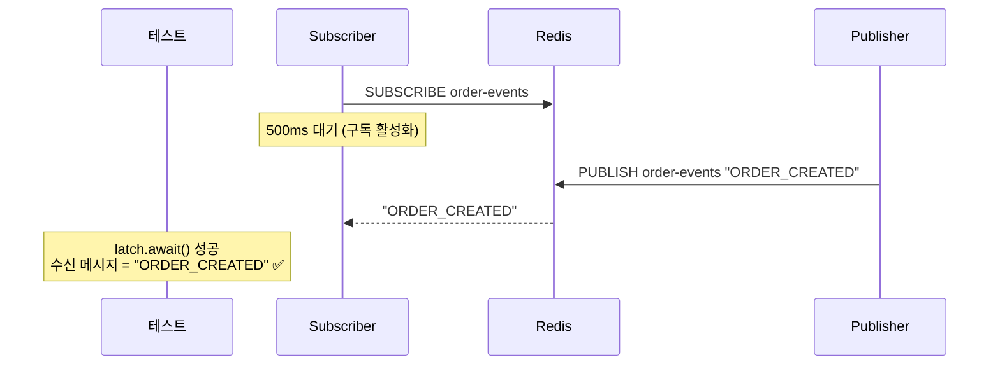
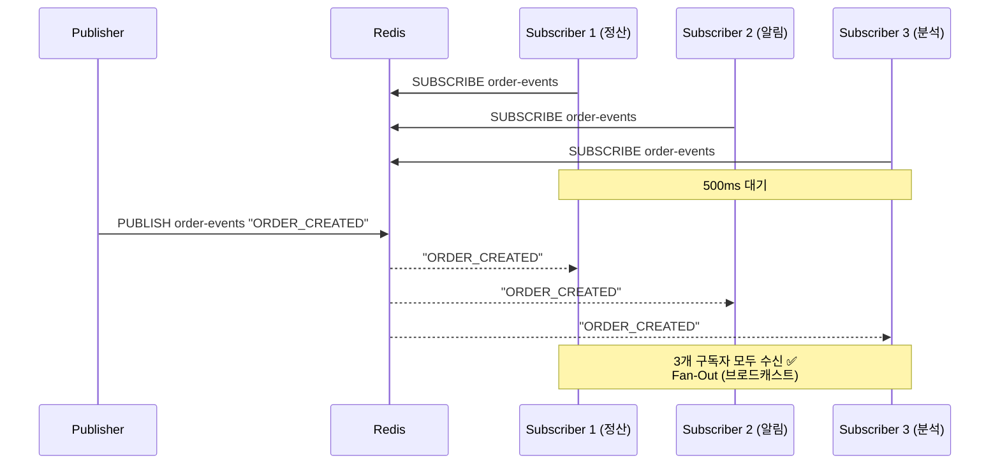
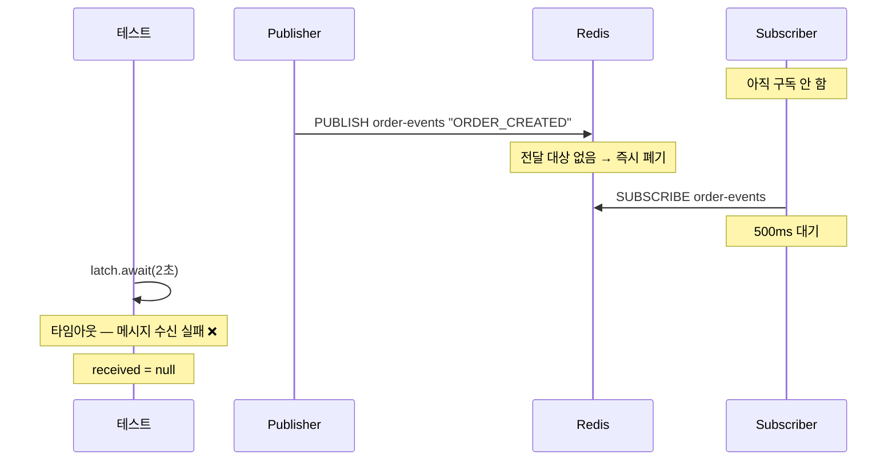
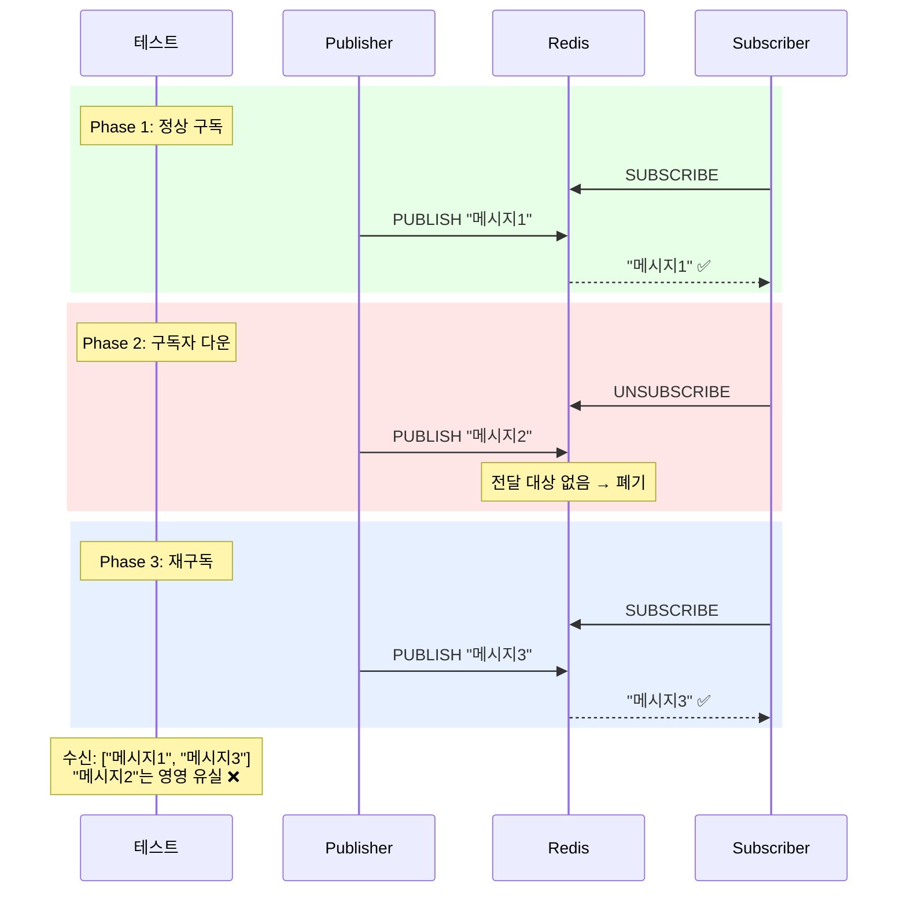

# Step 4 — Redis Pub/Sub 학습 테스트

Redis Pub/Sub의 기본 동작, 브로드캐스트 특성, 그리고 메시지 비보존 한계를 확인한다.
프로세스 경계를 넘어 메시지를 전달할 수 있지만, 구독자가 없으면 메시지는 사라진다.

---

## RedisPubSubBasicTest

Redis Pub/Sub 기본 동작 — 발행한 메시지를 구독자가 수신하는 가장 단순한 흐름.

### 발행한 메시지를 구독자가 수신한다



---

## RedisPubSubBroadcastTest

브로드캐스트 특성 — 여러 구독자가 동일한 메시지를 모두 수신한다.

### 여러 구독자가 동일한 메시지를 모두 수신한다



---

## RedisPubSubMessageLossTest

메시지 비보존 특성 — 구독자가 없거나 다운된 동안 발행된 메시지는 유실된다.

### 구독자가 없으면 발행된 메시지는 유실된다



### 구독자가 다운된 동안 발행된 메시지는 수신할 수 없다



---

## 메시징 패턴: Fan-Out vs Competing Consumers

| 패턴 | 목적 | Redis Pub/Sub | Kafka |
|------|------|:---:|:---:|
| **Fan-Out** | 서로 다른 관심사가 같은 이벤트를 각자 처리 | O (브로드캐스트) | O (Consumer Group별 독립 소비) |
| **Competing Consumers** | 같은 관심사의 인스턴스가 부하 분산 | X | O (같은 Group 내 파티션 분배) |

## Backpressure와 Slow Consumer

- **Redis Pub/Sub**: 느린 Consumer가 처리하지 못한 메시지는 **사라진다**. Push 모델이라 Producer 속도에 Consumer가 맞춰야 한다.
- **Kafka** (Step 5): 느린 Consumer는 offset 갭(lag)이 늘어날 뿐, 메시지는 **로그에 남아있다**. Pull 모델이라 Consumer가 자기 속도로 읽는다.

---

## 학습 포인트

이 Step을 마치면 다음 질문에 답할 수 있어야 합니다:

- [ ] Redis Pub/Sub으로 프로세스 경계를 넘어 메시지를 보낼 수 있는가? (Yes)
- [ ] 구독자가 없을 때 발행한 메시지는 어디로 가는가?
- [ ] 구독자가 다운됐다가 복구되면 그 사이 메시지를 받을 수 있는가? 왜?
- [ ] Redis Pub/Sub이 캐시 무효화에는 적합하지만 주문 이벤트에는 부적합한 이유는?
- [ ] Fan-Out과 Competing Consumers의 차이는? Redis Pub/Sub이 후자를 지원 못하는 이유는?

> `RedisPubSubMessageLossTest`의 3단계 시나리오(구독 → 다운 → 재구독)를 따라가며, 어느 구간의 메시지가 유실되는지 확인해 보세요.

---

## Testcontainer

이 Step은 Redis Testcontainer를 사용합니다. Docker가 실행 중이어야 합니다.

```
GenericContainer("redis:7-alpine") - port 6379
```

## 체험할 한계 -> Step 5로

메시지가 저장되지 않는다. 구독자가 없으면 증발한다.
"어제 이벤트를 다시 처리해야 해"라는 요구가 오면 불가능하다.
