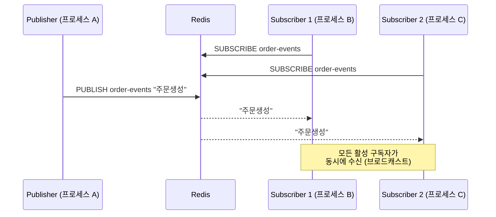
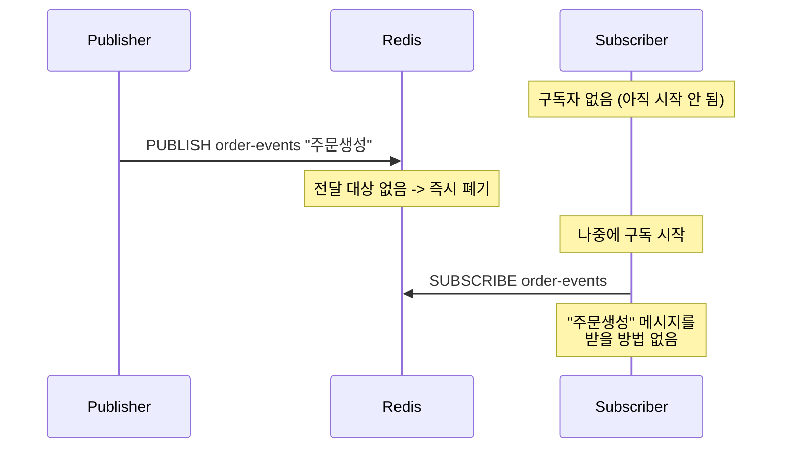
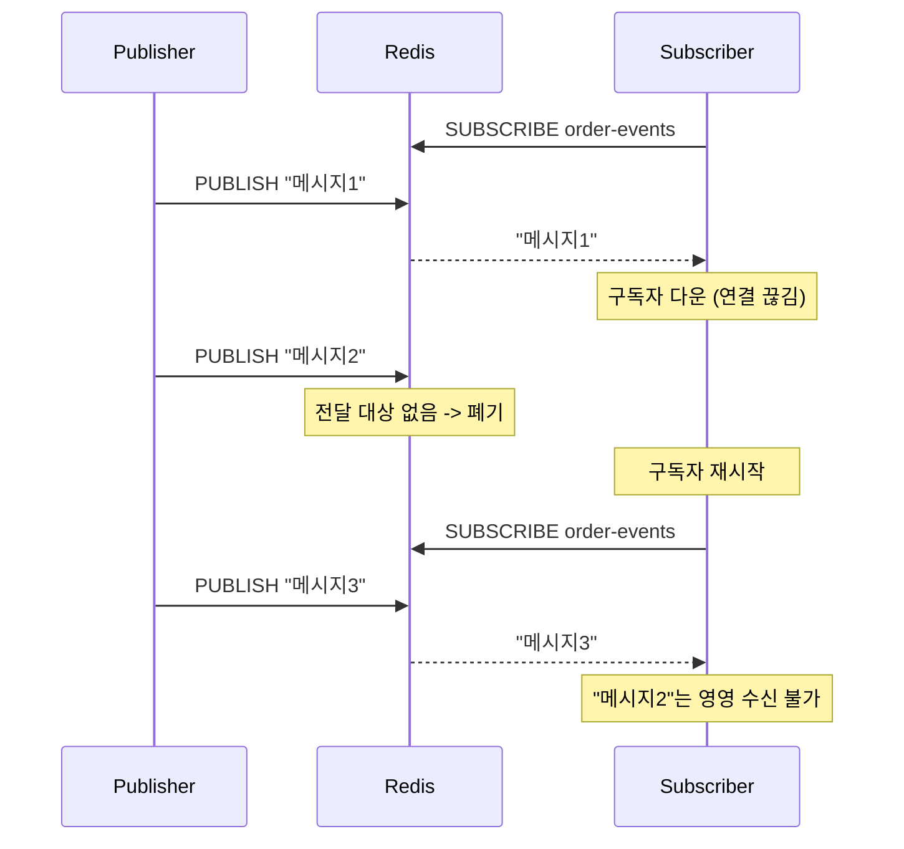

# Step 4 - Redis Pub/Sub

> 프로세스 경계를 넘어 이벤트를 전달할 수 있다. 단, 듣고 있는 놈만 받는다.

---

## 이 Step에서 해결하는 문제

Step 3까지는 이벤트가 단일 프로세스 안에서만 순환했습니다.
정산 서비스, 알림 서비스, 분석 서비스에도 이벤트를 보내야 한다면?
**프로세스 경계를 넘어야 합니다.**

## Redis Pub/Sub의 특성

- 프로세스 경계를 넘어 메시지를 전달할 수 있다
- **메시지는 보존되지 않는다** — 구독 중인 클라이언트만 수신
- Fire-and-forget 모델
- 적합: 캐시 무효화 신호, 실시간 알림
- 부적합: 주문/결제 같은 유실 불가 이벤트

## 메시징 패턴: Fan-Out (브로드캐스트)

Redis Pub/Sub은 **Fan-Out** 패턴이다 — 모든 구독자가 같은 메시지를 받는다.

```
Publisher → Redis Channel → Subscriber A (정산)
                          → Subscriber B (알림)
                          → Subscriber C (분석)
```

이 패턴은 **"서로 다른 관심사가 같은 이벤트를 각자 처리"**할 때 적합하다.
반대 패턴인 **Competing Consumers** (같은 관심사의 여러 인스턴스가 메시지를 나눠 처리)는
Redis Pub/Sub으로는 불가능하다 — Step 5(Kafka Consumer Group)에서 다룬다.

| 패턴 | 목적 | Redis Pub/Sub | Kafka |
|------|------|:---:|:---:|
| **Fan-Out** | 서로 다른 관심사가 같은 이벤트를 각자 처리 | O (브로드캐스트) | O (Consumer Group별 독립 소비) |
| **Competing Consumers** | 같은 관심사의 인스턴스가 부하 분산 | X | O (같은 Group 내 파티션 분배) |

---

## 시퀀스 다이어그램

### 기본 Pub/Sub 흐름



### 메시지 유실: 구독자 없음



### 메시지 유실: 구독자 다운타임



---

## 테스트 목록

| 테스트 클래스 | 메서드 | 증명하는 것 |
|---|---|---|
| RedisPubSubBasicTest | 발행한_메시지를_구독자가_수신한다 | 기본 동작 |
| RedisPubSubBroadcastTest | 여러_구독자가_동일한_메시지를_모두_수신한다 | 브로드캐스트 |
| RedisPubSubMessageLossTest | 구독자가_없으면_발행된_메시지는_유실된다 | 비보존 (구독자 없음) |
| RedisPubSubMessageLossTest | 구독자가_다운된_동안_발행된_메시지는_수신할_수_없다 | 비보존 (다운타임) |

## 학습 포인트

이 Step을 마치면 다음 질문에 답할 수 있어야 합니다:

- [ ] Redis Pub/Sub으로 프로세스 경계를 넘어 메시지를 보낼 수 있는가? (Yes)
- [ ] 구독자가 없을 때 발행한 메시지는 어디로 가는가?
- [ ] 구독자가 다운됐다가 복구되면 그 사이 메시지를 받을 수 있는가? 왜?
- [ ] Redis Pub/Sub이 캐시 무효화에는 적합하지만 주문 이벤트에는 부적합한 이유는?
- [ ] Fan-Out과 Competing Consumers의 차이는? Redis Pub/Sub이 후자를 지원 못하는 이유는?

> `RedisPubSubMessageLossTest`의 3단계 시나리오(구독 → 다운 → 재구독)를 따라가며, 어느 구간의 메시지가 유실되는지 확인해 보세요.

---

## Testcontainer

이 Step은 Redis Testcontainer를 사용합니다. Docker가 실행 중이어야 합니다.

```
GenericContainer("redis:7-alpine") - port 6379
```

## Backpressure와 Slow Consumer

Producer가 Consumer보다 빠르면 어떻게 되는가?

- **Redis Pub/Sub**: 느린 Consumer가 처리하지 못한 메시지는 **사라진다**. Push 모델이라 Producer 속도에 Consumer가 맞춰야 한다.
- **Kafka** (Step 5): 느린 Consumer는 offset 갭(lag)이 늘어날 뿐, 메시지는 **로그에 남아있다**. Pull 모델이라 Consumer가 자기 속도로 읽는다.

이 차이가 "보존이 필요한 이벤트에는 Redis Pub/Sub이 부적합한" 또 하나의 이유다.

## 체험할 한계 -> Step 5로

메시지가 저장되지 않는다. 구독자가 없으면 증발한다.
"어제 이벤트를 다시 처리해야 해"라는 요구가 오면 불가능하다.
