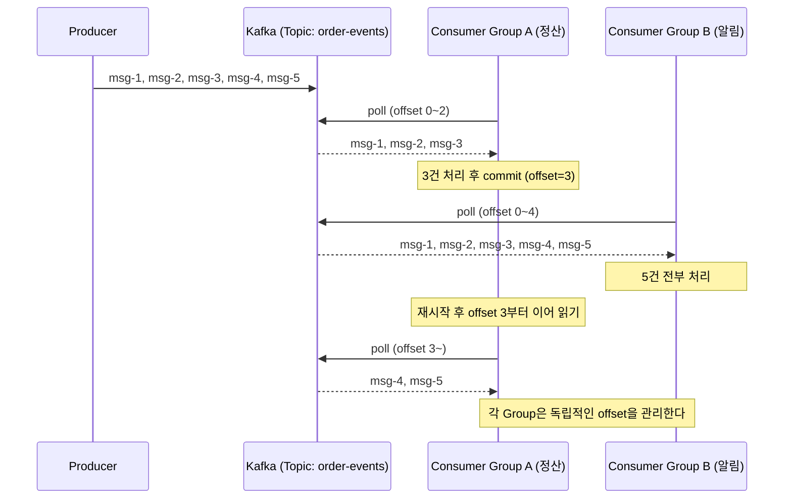
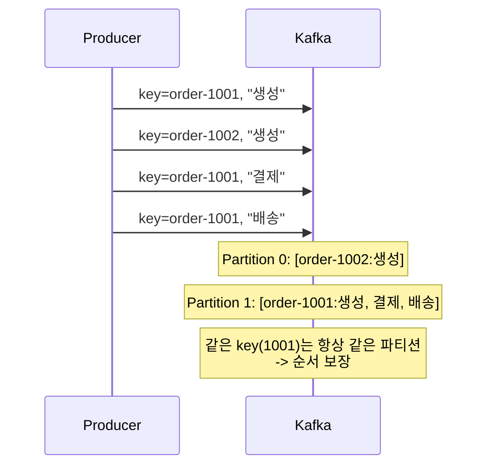
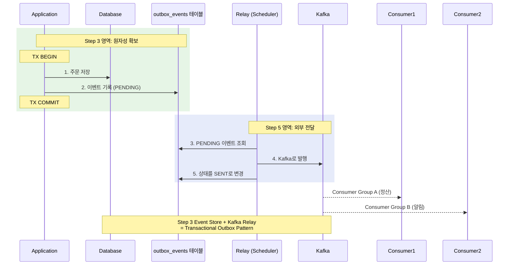

# Step 5 - Kafka

> 메시지가 로그로 보존된다. 여러 Consumer가 각자 속도로 독립적으로 읽는다.
> Step 3의 Event Store를 Kafka로 릴레이하면 - Transactional Outbox Pattern이 완성된다.

---

## 핵심 개념

### Kafka 로그 모델

메시지는 토픽의 파티션에 **append-only 로그**로 기록된다.
Consumer는 각자의 offset을 관리하며, 같은 메시지를 여러 Consumer Group이 독립적으로 읽을 수 있다.

### Redis Pub/Sub vs Kafka

| 특성 | Redis Pub/Sub | Kafka |
|------|:---:|:---:|
| 메시지 보존 | X (즉시 폐기) | O (로그에 보존) |
| 구독자 없을 때 | 유실 | 보존 |
| Consumer 재시작 | 놓친 메시지 없음 | offset부터 이어 읽기 |
| 다중 Consumer | 브로드캐스트 | Consumer Group별 독립 소비 |

### Fan-Out vs Competing Consumers

Kafka는 두 가지 메시징 패턴을 모두 지원한다:

- **Fan-Out**: 서로 다른 Consumer Group이 같은 메시지를 독립적으로 소비 (정산 Group + 알림 Group)
- **Competing Consumers**: 같은 Consumer Group 내 여러 인스턴스가 파티션을 나눠 부하 분산

Redis Pub/Sub은 Fan-Out만 가능했지만, Kafka는 Consumer Group 개념으로 두 패턴을 동시에 지원한다.

---

## 시퀀스 다이어그램

### Consumer Group 독립성



### 같은 Key -> 같은 Partition -> 순서 보장



### Transactional Outbox Pattern 완성

Step 3과 Step 5가 각각 어떤 문제를 해결하고, 합쳐져서 Outbox가 되는지를 보여줍니다.

```
Step 3이 해결한 것                      Step 5가 해결한 것
─────────────────────                  ─────────────────────
"이벤트가 유실되면 안 된다"                "이벤트가 프로세스 밖으로 나가야 한다"

도메인 저장 + 이벤트 기록                  Event Store → Kafka 릴레이
= 같은 TX (원자성)                       = 보존 + 비동기 전달

       합치면
       ──────
       Transactional Outbox Pattern
       "원자적으로 기록하고, 안전하게 전달한다"
```



---

## 테스트 목록

| 테스트 클래스 | 메서드 | 증명하는 것 |
|---|---|---|
| KafkaBasicPipelineTest | Producer가_보낸_메시지를_Consumer가_수신한다 | 기본 파이프라인 |
| KafkaBasicPipelineTest | 여러_메시지를_순서대로_발행하면_같은_파티션에서_순서대로_소비된다 | 파티션 내 순서 |
| KafkaMessagePreservationTest | Consumer가_중지된_사이에_발행된_메시지를_재시작_후_이어서_읽는다 | 메시지 보존 |
| KafkaMessagePreservationTest | 구독자가_없어도_메시지는_Kafka에_보존된다 | Redis 대비 차이 |
| KafkaConsumerGroupIndependenceTest | 두_Consumer_Group이_같은_토픽의_모든_메시지를_각각_독립적으로_수신한다 | Group 독립성 |
| KafkaConsumerGroupIndependenceTest | 한_Consumer_Group의_소비_속도가_다른_Group에_영향을_주지_않는다 | 속도 독립성 |
| KafkaPartitionOrderingTest | 같은_key의_메시지는_같은_파티션에_저장된다 | Key-Partition 매핑 |
| KafkaPartitionOrderingTest | 같은_파티션의_메시지는_발행_순서대로_소비된다 | 파티션 내 순서 |
| KafkaPartitionOrderingTest | 다른_key의_메시지는_다른_파티션으로_분배될_수_있다 | 파티션 분배 |
| TransactionalOutboxCompletionTest | 주문_저장과_이벤트_기록이_하나의_트랜잭션으로_묶인다 | 원자성 |
| TransactionalOutboxCompletionTest | 릴레이가_PENDING_이벤트를_Kafka로_발행하고_SENT로_변경한다 | Outbox 완성 |
| TransactionalOutboxCompletionTest | Kafka_발행_실패_시_이벤트는_여전히_PENDING_상태를_유지한다 | 실패 복구 |

## Testcontainer

```
KafkaContainer("confluentinc/cp-kafka:7.6.0") - KRaft mode (ZooKeeper 불필요)
```

## 학습 포인트

이 Step을 마치면 다음 질문에 답할 수 있어야 합니다:

- [ ] Redis Pub/Sub에서 구독자가 없으면 메시지가 유실되는데, Kafka에서는 왜 보존되는가?
- [ ] Consumer Group A가 느려도 Group B에 영향이 없는 이유는?
- [ ] 같은 key의 메시지가 같은 파티션에 들어가면 왜 순서가 보장되는가?
- [ ] Step 3의 Event Store + 이 Step의 Kafka Relay = Transactional Outbox. 각각이 어떤 문제를 해결하는가?
- [ ] Kafka 발행이 실패하면 이벤트 상태가 왜 PENDING으로 남아야 하는가?

> `TransactionalOutboxCompletionTest`에서 Step 3의 원자성 테스트와 이 Step의 릴레이 테스트가 어떻게 연결되는지 비교해 보세요.

---

## 중복이 왜 발생하는가 -> Step 6

Kafka는 At Least Once 전달이 기본이다.
Consumer가 메시지를 처리한 뒤 offset을 커밋하기 직전에 죽으면,
재시작 시 같은 메시지를 다시 읽게 된다.
-> 포인트가 2번 적립되거나 쿠폰이 2번 발급된다.
