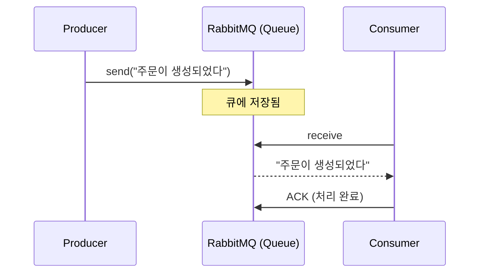
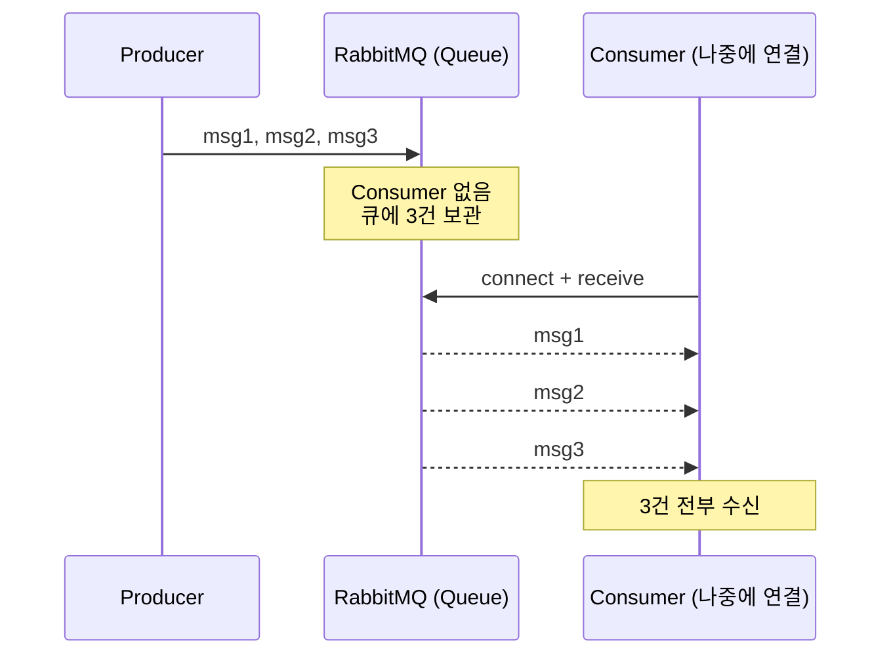
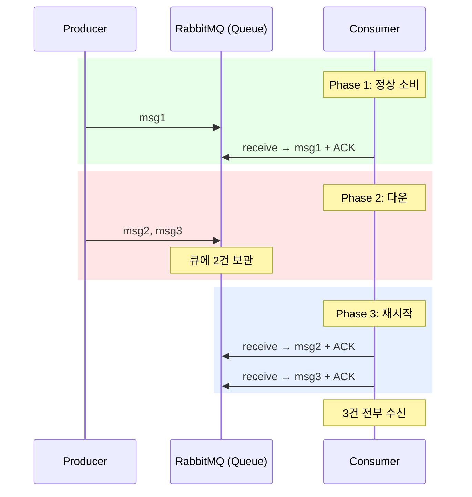
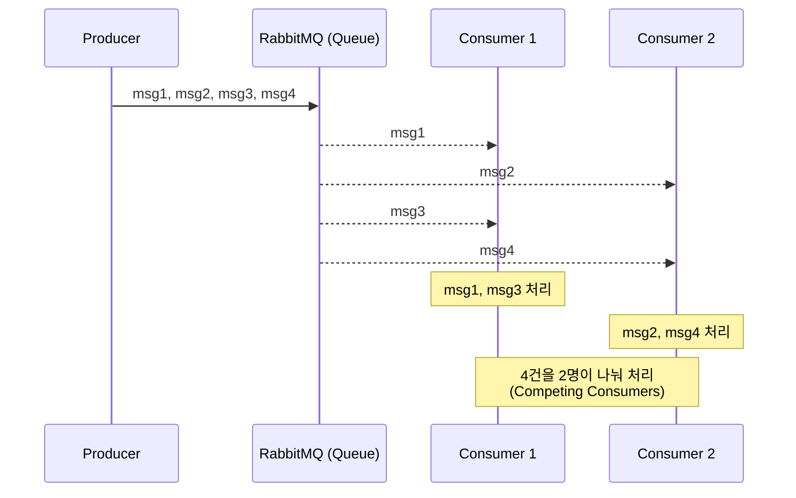
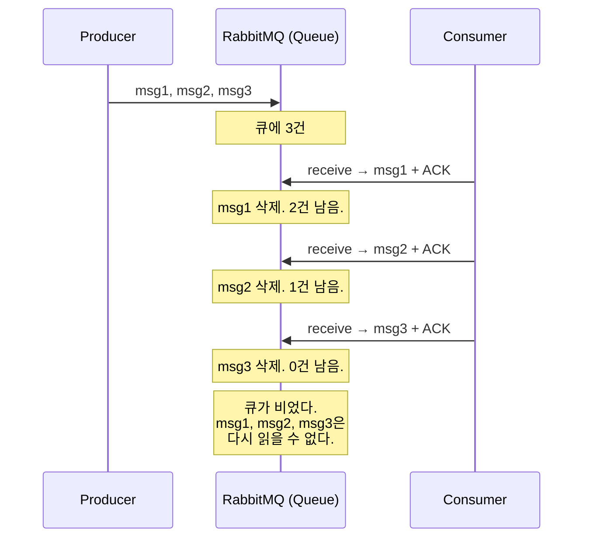
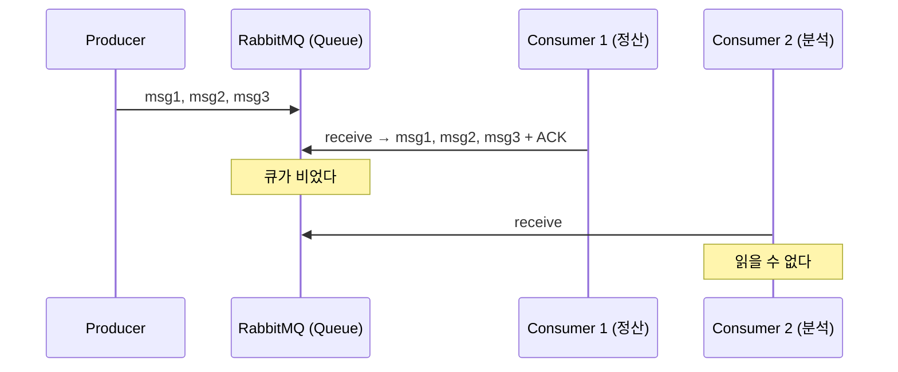

# Step 5 — RabbitMQ

---

## Step 4의 한계에서 시작하자

Step 4에서 Redis Pub/Sub으로 프로세스 경계를 넘었다. 근데 두 가지 문제가 있었다.

```
1. 구독자가 없으면 메시지가 사라진다
2. 구독자가 잠깐 다운되면 그 사이 메시지가 유실된다
```

이유는 Redis Pub/Sub이 **메시지를 저장하지 않기 때문**이었다. 발행 시점에 듣고 있는 클라이언트에게 밀어넣고(Push), 전달할 대상이 없으면 버린다.

그러면 **"메시지를 큐에 저장하는" 메시지 브로커**를 쓰면 해결되지 않을까?

---

## RabbitMQ — 메시지를 큐에 저장한다

RabbitMQ는 메시지를 **큐(Queue)에 보관**한다. Producer가 메시지를 보내면 큐에 쌓이고, Consumer가 읽어갈 때까지 남아있다.



> **RabbitMQBasicPipelineTest** — `Producer가_보낸_메시지를_Consumer가_수신한다()`에서 확인.

Redis Pub/Sub과 다른 점이 바로 보인다. **메시지가 큐에 저장된다.** Consumer가 아직 없어도.

---

## Redis에서 해결 못 한 문제가 해결된다

Redis Pub/Sub에서 구독자가 없으면 메시지가 사라졌다. RabbitMQ는?



> **RabbitMQMessagePreservationTest** — `Consumer가_없어도_메시지는_큐에_보존된다()`에서 확인.

**Redis Pub/Sub이었다면 3건 전부 유실됐다.** RabbitMQ는 큐에 저장하니까, Consumer가 나중에 연결해도 받을 수 있다.

Consumer가 다운됐다가 재시작하면?



> **RabbitMQMessagePreservationTest** — `Consumer가_다운된_동안_발행된_메시지를_재시작_후_수신한다()`에서 확인.

Redis Pub/Sub의 "배포 30초 동안 유실" 문제가 해결됐다. 큐에 남아있으니까.

---

## 같은 큐에서 부하를 나눌 수 있다

Redis Pub/Sub은 모든 구독자가 같은 메시지를 받았다(브로드캐스트). RabbitMQ 큐는 다르다. 같은 큐에 Consumer 2개가 붙으면 **메시지를 나눠 가진다.**



> **RabbitMQCompetingConsumersTest** — `같은_큐의_Consumer_2개가_메시지를_나눠_처리한다()`에서 확인.

이건 Redis Pub/Sub에서 못 했던 패턴이다. 처리량이 늘어나면 Consumer를 추가해서 부하를 분산할 수 있다.

---

## 그런데 — 소비한 메시지는 사라진다

여기까지 보면 RabbitMQ가 Redis Pub/Sub의 상위 호환처럼 보인다. 근데 한 가지 근본적인 특성이 있다.

**Consumer가 ACK하면 메시지가 큐에서 삭제된다.**



> **RabbitMQMessageDeletionTest** — `ACK한_메시지는_큐에서_삭제되어_다시_읽을_수_없다()`에서 확인.

이게 왜 문제인가?

```
"어제 포인트 적립 로직에 버그가 있었어.
 어제 주문 이벤트를 처음부터 다시 처리해야 해."

Redis Pub/Sub: 불가능. 메시지를 저장 안 하니까.
RabbitMQ:      불가능. 소비하면서 삭제했으니까.
```

---

## 소비 완료된 메시지를 다른 시스템이 읽을 수 없다



> **RabbitMQNoReplayTest** — `소비_완료된_메시지를_다른_Consumer가_다시_읽을_수_없다()`에서 확인.

Kafka라면 Consumer Group이 다르면 같은 메시지를 독립적으로 읽을 수 있다. RabbitMQ는 한 Consumer가 읽으면 끝이다.

---

## 세 도구를 나란히 놓으면

| | Redis Pub/Sub | RabbitMQ | Kafka (Step 6) |
|---|:---:|:---:|:---:|
| 메시지 저장 | X | O (큐에 보관) | O (로그에 보관) |
| 소비 후 보존 | X | **X (삭제)** | O (남아있음) |
| 재처리 | X | X | O (offset 되돌림) |
| Consumer 없을 때 | 유실 | 큐에 보관 | 로그에 보관 |
| 부하 분산 | X | O (Competing) | O (Partition 분배) |
| 독립적 다중 소비 | 브로드캐스트만 | Exchange 설정 필요 | Consumer Group |

---

## 스스로 답해보자

- Redis Pub/Sub에서 구독자가 없으면 유실되는데, RabbitMQ에서는 왜 보존되는가?
- RabbitMQ에서 Consumer가 ACK하면 메시지는 어떻게 되는가?
- "어제 이벤트를 다시 처리해야 해" — RabbitMQ로 가능한가? 왜?
- Competing Consumers와 Fan-Out의 차이는? RabbitMQ에서 Fan-Out을 하려면?
- Redis → RabbitMQ → Kafka로 올 때, 각 단계에서 해결한 것과 못 한 것은?

> 답이 바로 나오면 Step 6으로 넘어가자.
> 막히면 `RabbitMQMessageDeletionTest`와 `RabbitMQNoReplayTest`를 실행해서 확인하자.

---

## 다음 Step으로

RabbitMQ는 "아직 안 읽은 메시지"를 보존하지만, "이미 읽은 메시지"는 사라진다. **재처리가 불가능하다.**

Step 6에서 Kafka를 쓰면 메시지가 **소비해도 로그에 남아있다.** Consumer의 offset을 되돌리면 과거 이벤트를 다시 읽을 수 있다. 그리고 Step 3의 Event Store와 합치면 **Transactional Outbox Pattern이 완성**된다.
