# Step 6 — Idempotent Consumer 학습 테스트

At Least Once 환경에서 중복 소비가 발생하는 문제를 체험한다.
세 가지 멱등 패턴을 구현하고 트레이드오프를 비교한다.
처리 불가능한 메시지(poison pill)를 DLQ로 격리하는 개념을 확인한다.

---

## DuplicateConsumptionProblemTest

멱등 처리 없이 같은 메시지를 2번 소비하면 데이터가 2번 반영되는 문제.

### 같은 메시지를 2번 소비하면 포인트가 2번 적립된다

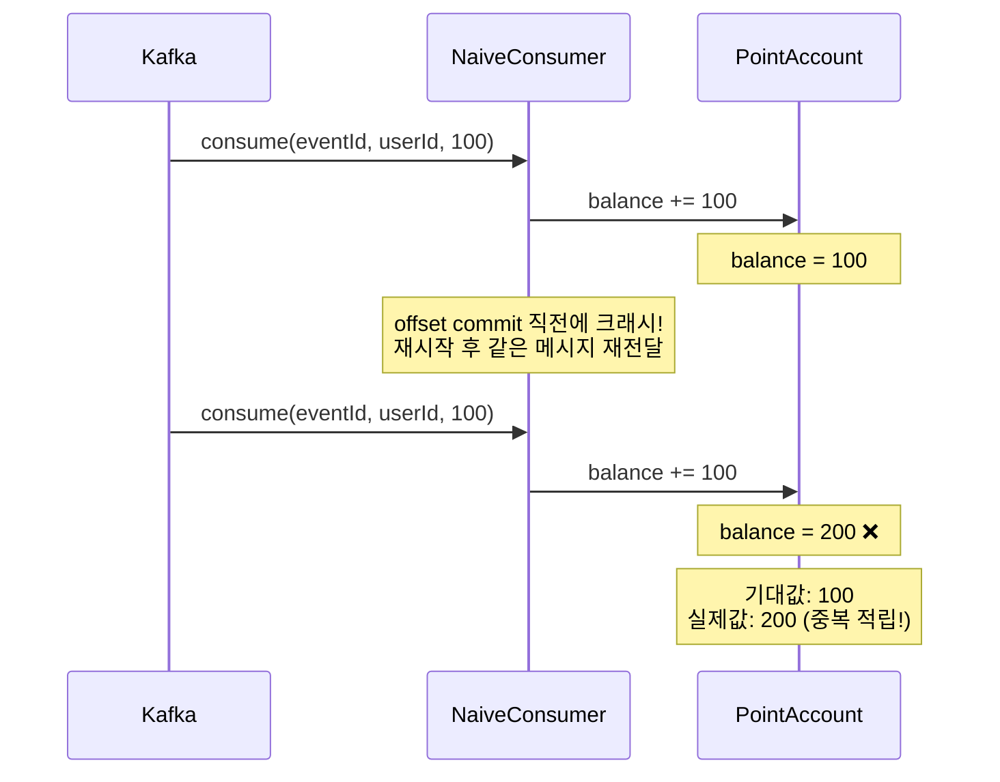

---

## EventHandledIdempotencyTest

event_handled 테이블로 중복을 방어하는 패턴 — 범용, 어떤 도메인이든 적용 가능.

### event_handled 테이블에 이미 처리된 이벤트가 있으면 스킵한다

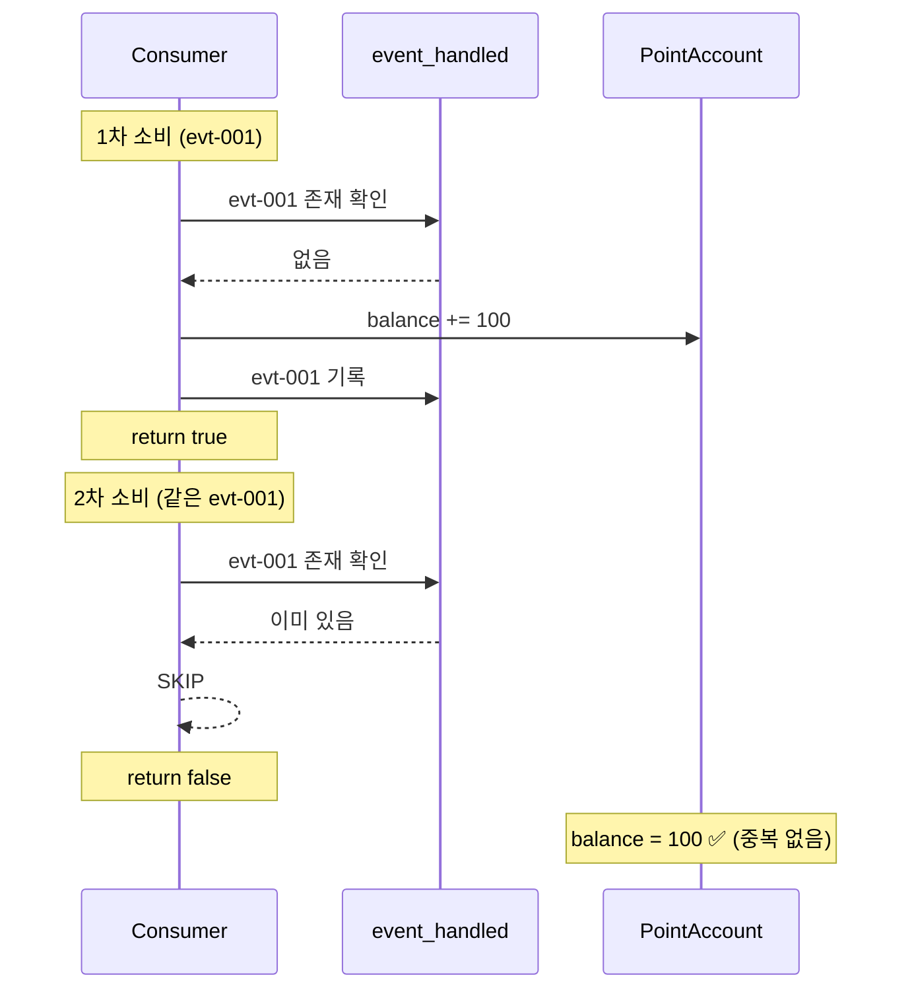

### 서로 다른 event_id의 메시지는 각각 정상 처리된다

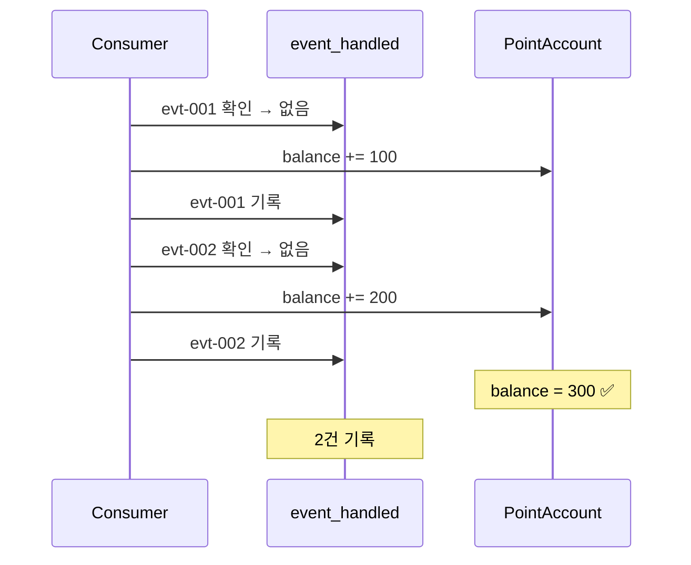

---

## UpsertIdempotencyTest

Upsert 패턴 — 집계성 데이터(조회수, 좋아요수)에 적합한 멱등 패턴.

### 같은 이벤트를 2번 처리해도 upsert로 올바른 결과가 유지된다

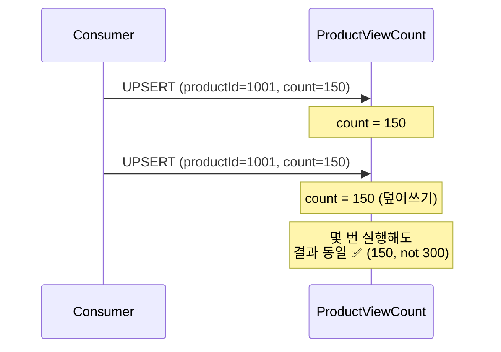

### upsert는 최신 값으로 덮어쓰므로 최종 상태가 보장된다

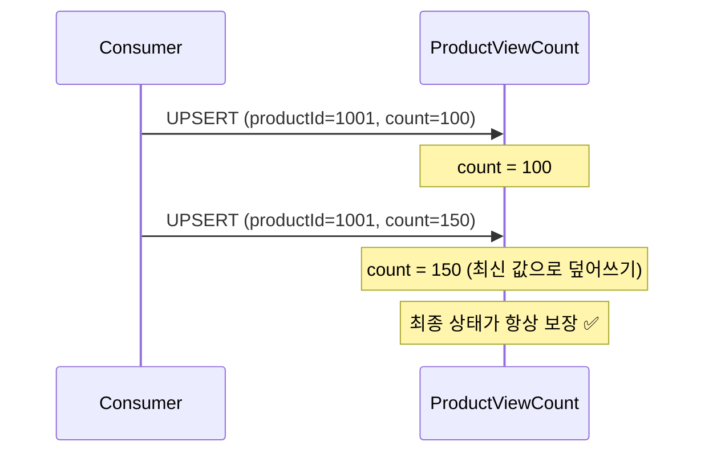

### 다른 상품의 이벤트는 각각 독립적으로 upsert된다

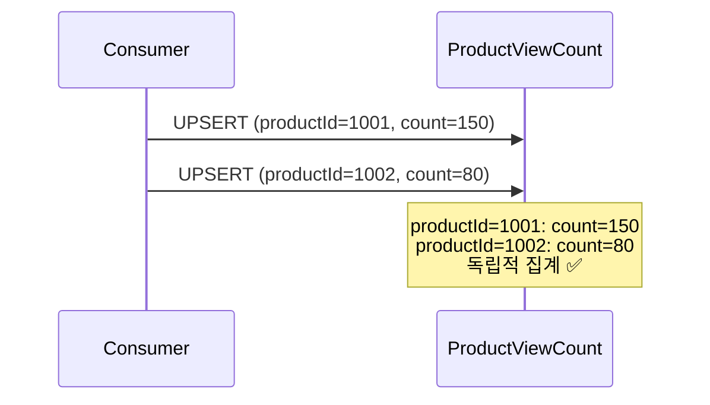

---

## VersionComparisonIdempotencyTest

version 비교 패턴 — 중복뿐 아니라 순서 역전까지 방어.

### version이 현재보다 높은 이벤트만 반영된다

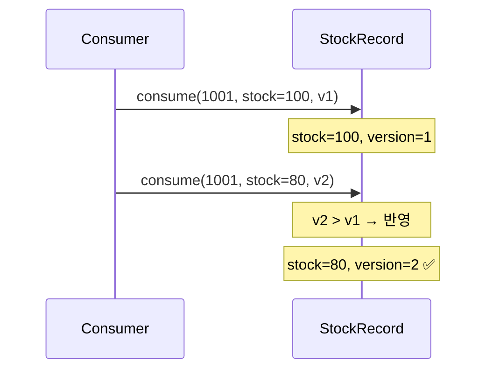

### version이 현재보다 낮거나 같은 이벤트는 무시된다

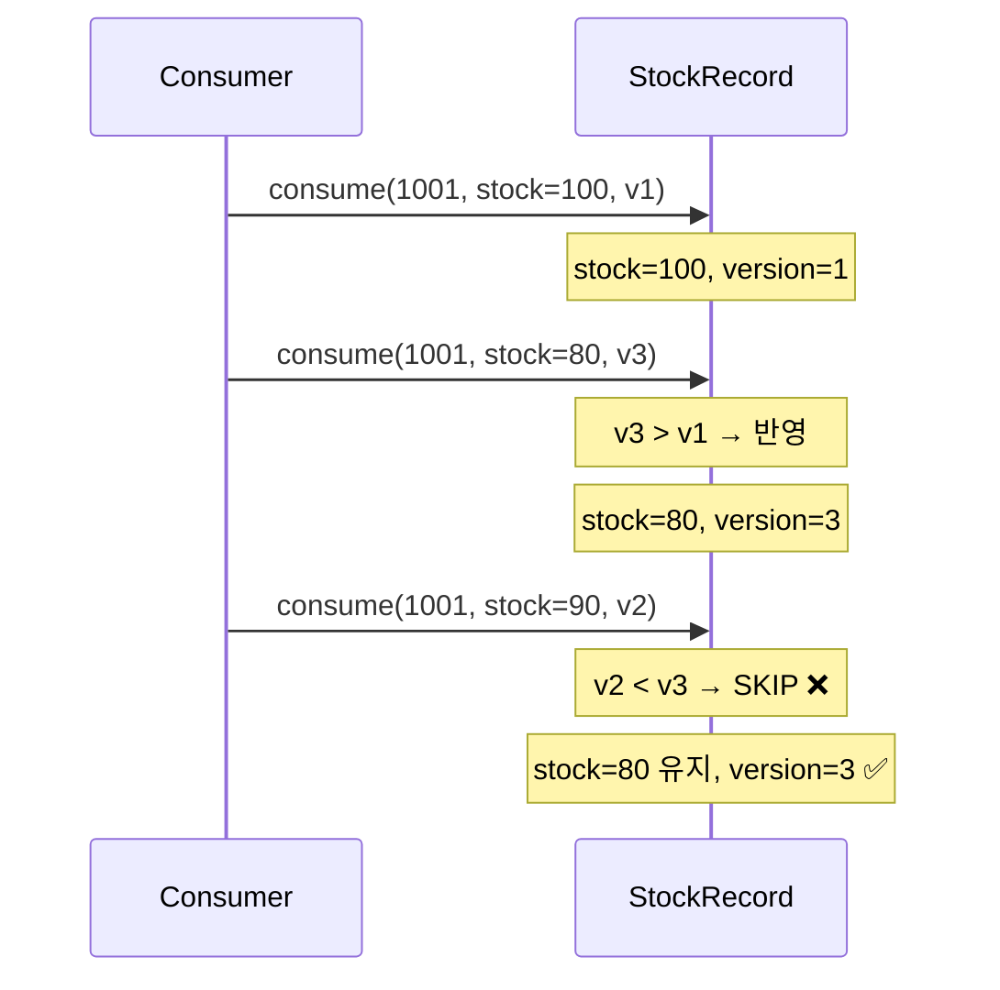

### 순서가 역전된 이벤트 시퀀스에서 최종 상태가 올바르다

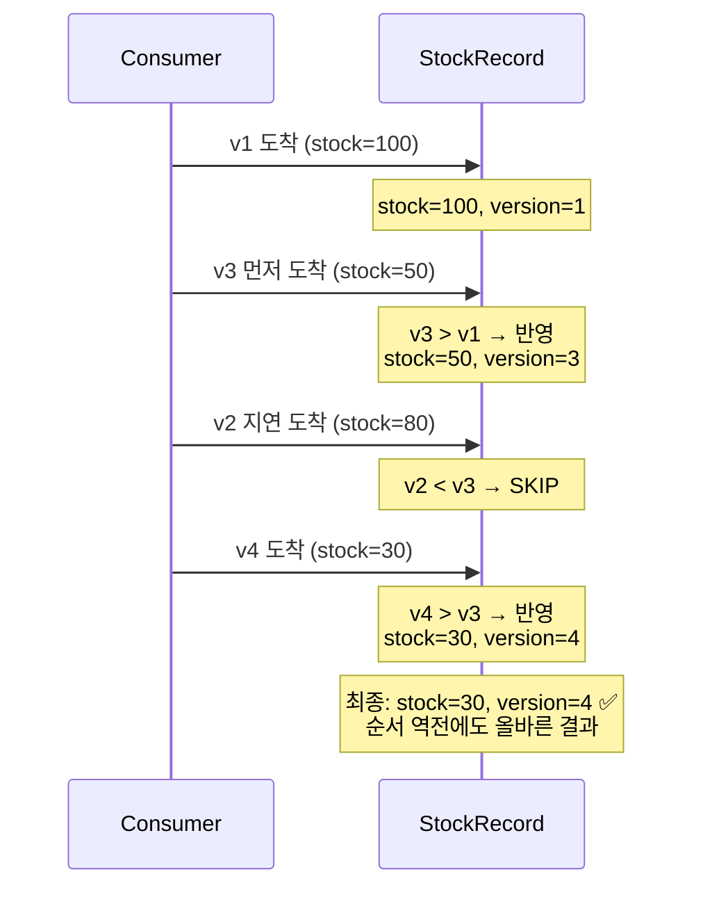

---

## PoisonPillAndDlqTest

Poison pill이 Consumer를 막는 문제와 DLQ 격리.
Spring Kafka의 ErrorHandler 대신 순수 Kafka API로 개념을 증명한다.

### 파싱 불가능한 메시지가 Consumer를 막는다

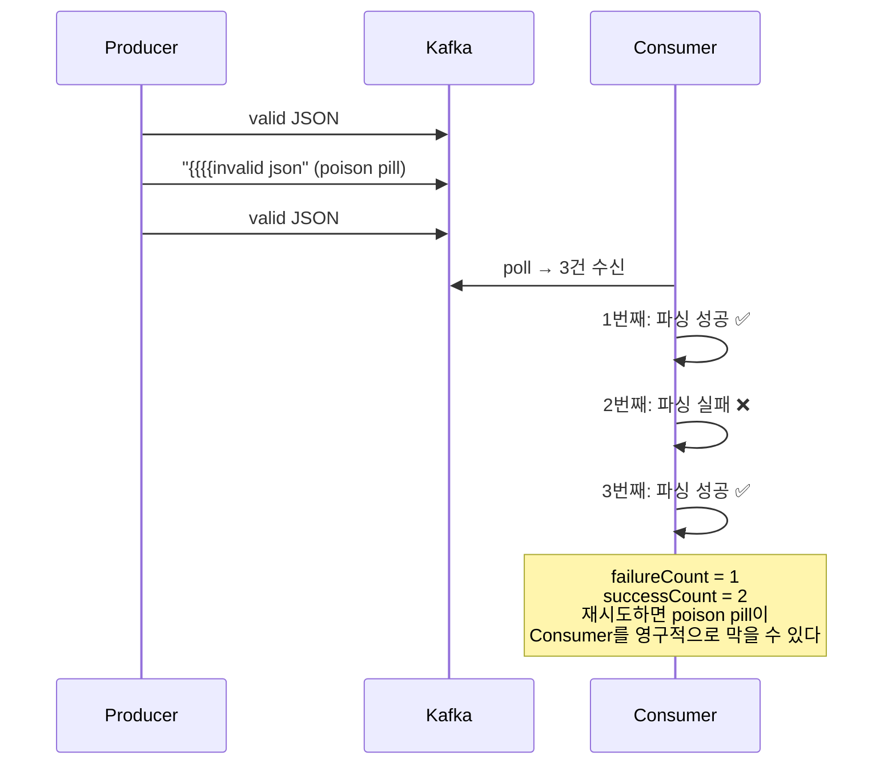

### 처리 실패한 메시지를 DLQ 토픽으로 격리할 수 있다

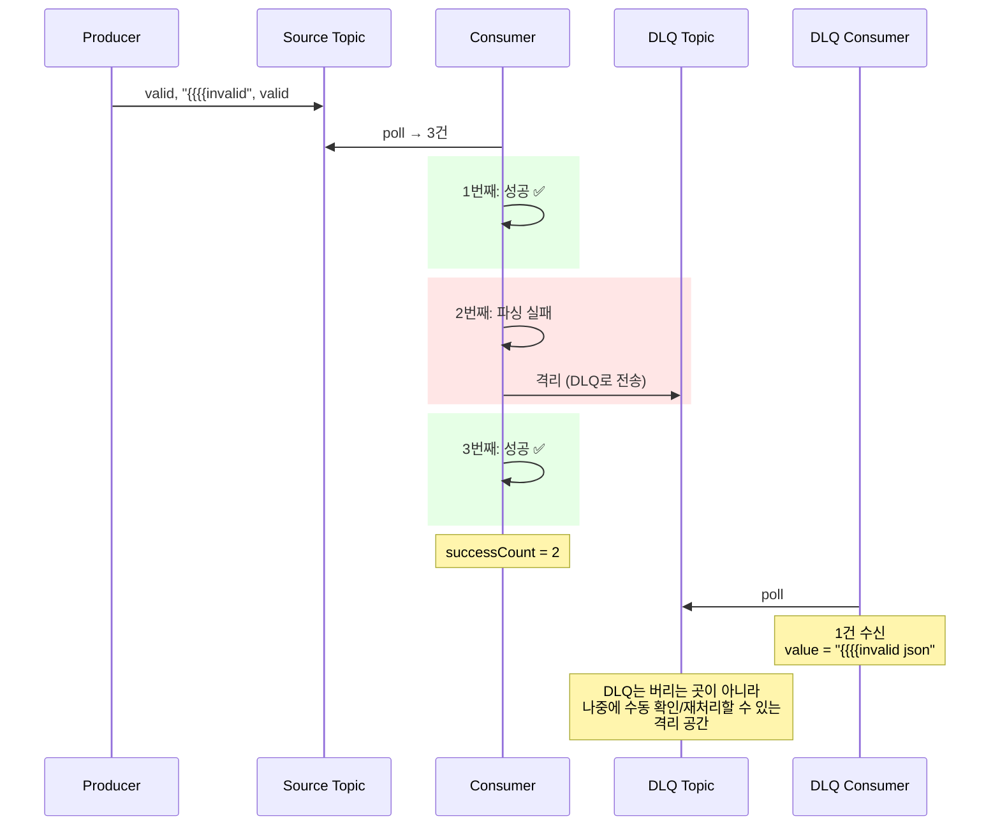

---

## 멱등 패턴 비교

| 패턴 | 적합한 상황 | 트레이드오프 |
|------|-----------|------------|
| event_handled(event_id PK) | 범용, 어떤 도메인이든 적용 가능 | 별도 테이블 필요, 조회 비용 |
| Upsert | 집계성 데이터 (조회수, 좋아요수) | 도메인 특성에 의존, 범용성 낮음 |
| version / updated_at 비교 | 순서 역전까지 방어해야 하는 경우 | 구현 복잡도 높음 |

---

## 학습 포인트

이 Step을 마치면 다음 질문에 답할 수 있어야 합니다:

- [ ] At Least Once 환경에서 중복이 발생하는 정확한 시나리오는? (offset commit 직전 크래시)
- [ ] event_handled 패턴은 범용적이지만 어떤 비용이 있는가?
- [ ] Upsert가 멱등한 이유는? 어떤 종류의 데이터에만 적합한가?
- [ ] version 비교 패턴은 중복뿐 아니라 무엇까지 방어하는가? (순서 역전)
- [ ] 세 패턴 중 현재 팀의 도메인에 가장 적합한 것은? 왜?
- [ ] poison pill 메시지를 DLQ로 격리하지 않으면 어떤 일이 발생하는가?

> `DuplicateConsumptionProblemTest`를 먼저 실행해서 포인트가 200이 되는 문제를 직접 확인한 뒤, 세 가지 패턴이 각각 어떻게 해결하는지 비교해 보세요.

---

## 이 Step이 도구에 종속되지 않는 이유

멱등 처리와 실패 격리는 Kafka든 RabbitMQ든 Redis Streams든 동일하게 필요한 패턴이다.
**"발행은 At Least Once, 소비는 멱등하게, 실패는 격리"** — 이것이 신뢰 가능한 이벤트 파이프라인의 최종 공식이다.
