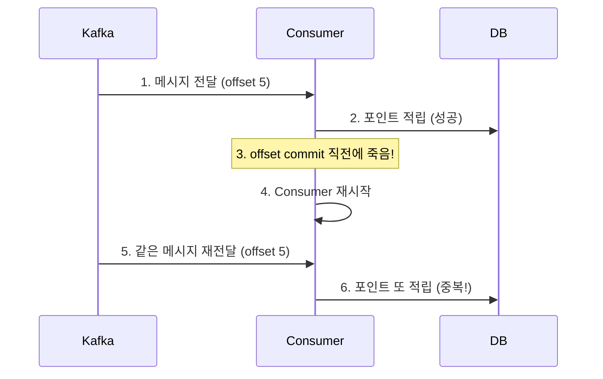
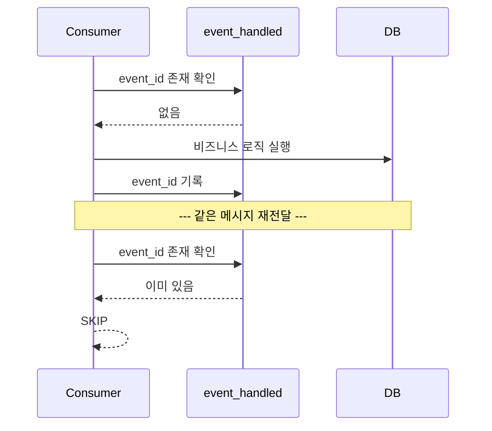
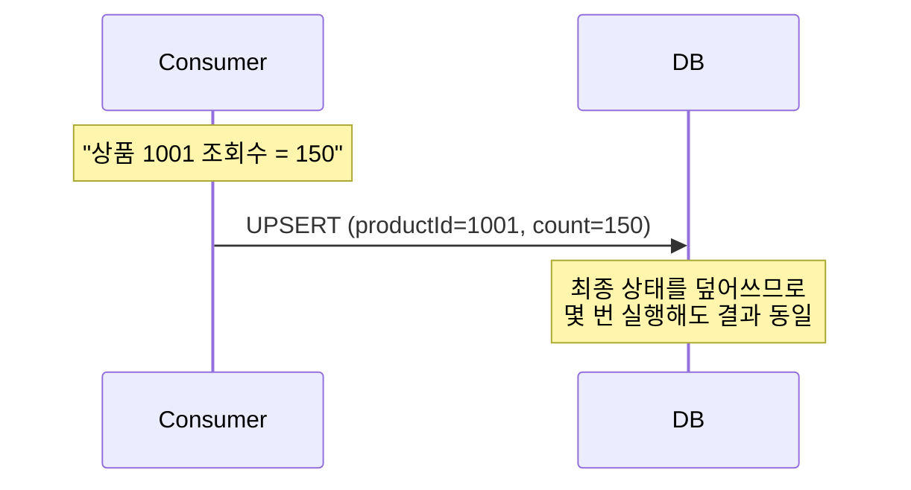
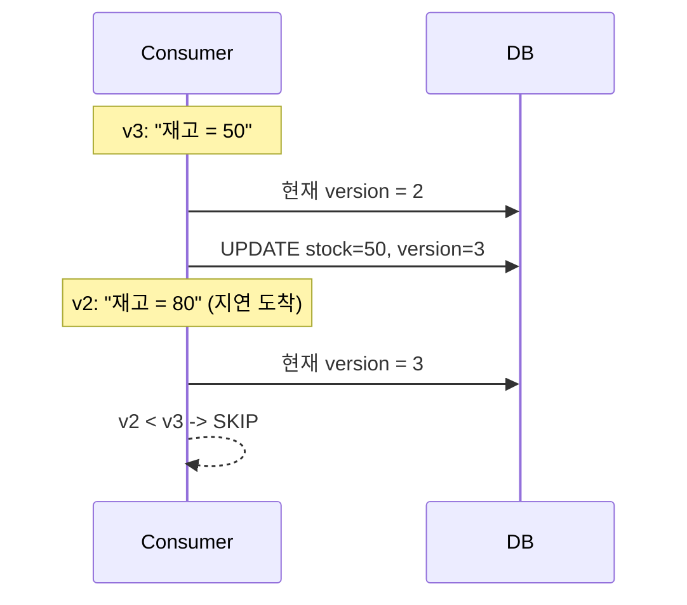
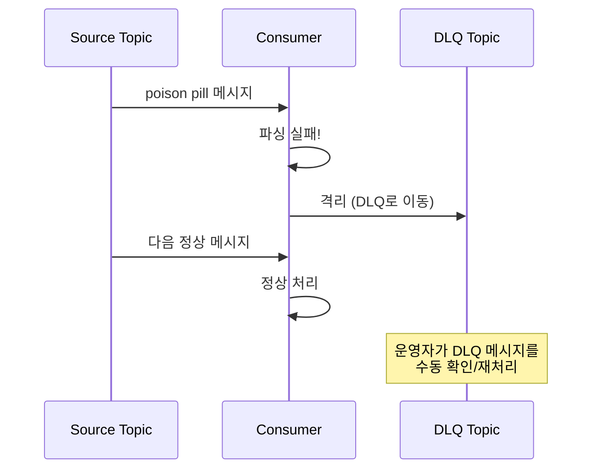

# Step 6 - Idempotent Consumer & Failure Isolation

> 메시지가 몇 번 오든 결과는 딱 한 번만 반영되어야 하고,
> 처리 불가능한 메시지는 격리되어야 한다.

---

## 학습 목표

- At Least Once 환경에서 중복 소비가 발생하는 상황을 체험한다
- 멱등 처리 패턴을 구현하고, 각 패턴의 트레이드오프를 이해한다
- 멱등 처리조차 실패하는 메시지를 DLQ로 격리하는 개념을 이해한다

---

## 시퀀스 다이어그램

### 중복 소비가 발생하는 이유

### 패턴 1: event_handled 테이블 (범용)

### 패턴 2: Upsert (집계성 데이터)

### 패턴 3: version 비교 (순서 보호)

### DLQ (Dead Letter Queue)

---

## 멱등 패턴 비교

| 패턴 | 적합한 상황 | 트레이드오프 |
|------|-----------|------------|
| event_handled(event_id PK) | 범용, 어떤 도메인이든 적용 가능 | 별도 테이블 필요, 조회 비용 |
| Upsert | 집계성 데이터 (조회수, 좋아요수) | 도메인 특성에 의존, 범용성 낮음 |
| version / updated_at 비교 | 순서 역전까지 방어해야 하는 경우 | 구현 복잡도 높음 |

---

## 테스트 목록

### 전반부: 멱등 처리

| 테스트 클래스 | 메서드 | 증명하는 것 |
|---|---|---|
| DuplicateConsumptionProblemTest | 같은_메시지를_2번_소비하면_포인트가_2번_적립된다 | 문제 체험 |
| EventHandledIdempotencyTest | event_handled_테이블에_이미_처리된_이벤트가_있으면_스킵한다 | 패턴 1 검증 |
| EventHandledIdempotencyTest | 서로_다른_event_id의_메시지는_각각_정상_처리된다 | 정상 흐름 |
| UpsertIdempotencyTest | 같은_이벤트를_2번_처리해도_upsert로_올바른_결과가_유지된다 | 패턴 2 검증 |
| UpsertIdempotencyTest | upsert는_최신_값으로_덮어쓰므로_최종_상태가_보장된다 | 덮어쓰기 |
| UpsertIdempotencyTest | 다른_상품의_이벤트는_각각_독립적으로_upsert된다 | 독립성 |
| VersionComparisonIdempotencyTest | version이_현재보다_높은_이벤트만_반영된다 | 패턴 3 검증 |
| VersionComparisonIdempotencyTest | version이_현재보다_낮거나_같은_이벤트는_무시된다 | 역전 방어 |
| VersionComparisonIdempotencyTest | 순서가_역전된_이벤트_시퀀스에서_최종_상태가_올바르다 | 종합 검증 |

### 후반부: 실패 격리

| 테스트 클래스 | 메서드 | 증명하는 것 |
|---|---|---|
| PoisonPillAndDlqTest | 파싱_불가능한_메시지가_Consumer를_막는다 | 문제 체험 |
| PoisonPillAndDlqTest | 처리_실패한_메시지를_DLQ_토픽으로_격리할_수_있다 | DLQ 격리 |

## 학습 포인트

이 Step을 마치면 다음 질문에 답할 수 있어야 합니다:

- [ ] At Least Once 환경에서 중복이 발생하는 정확한 시나리오는? (offset commit 직전 크래시)
- [ ] event_handled 패턴은 범용적이지만 어떤 비용이 있는가?
- [ ] Upsert가 멱등한 이유는? 어떤 종류의 데이터에만 적합한가?
- [ ] version 비교 패턴은 중복뿐 아니라 무엇까지 방어하는가? (순서 역전)
- [ ] 세 패턴 중 현재 팀의 도메인에 가장 적합한 것은? 왜?
- [ ] poison pill 메시지를 DLQ로 격리하지 않으면 어떤 일이 발생하는가?

> `DuplicateConsumptionProblemTest`를 먼저 실행해서 포인트가 200이 되는 문제를 직접 확인한 뒤, 세 가지 패턴이 각각 어떻게 해결하는지 비교해 보세요.

---

## 이 Step이 도구에 종속되지 않는 이유

멱등 처리와 실패 격리는 Kafka든 RabbitMQ든 Redis Streams든 동일하게 필요한 패턴이다.
**"발행은 At Least Once, 소비는 멱등하게, 실패는 격리"** — 이것이 신뢰 가능한 이벤트 파이프라인의 최종 공식이다.
