# Step 6 — Kafka 학습 테스트

Kafka의 메시지 보존, Consumer Group 독립성, 파티션 기반 순서 보장을 확인한다.
Step 3의 Event Store를 Kafka로 릴레이하면 Transactional Outbox Pattern이 완성된다.

---

## KafkaBasicPipelineTest

Kafka Producer → Consumer 기본 파이프라인.

### Producer가 보낸 메시지를 Consumer가 수신한다

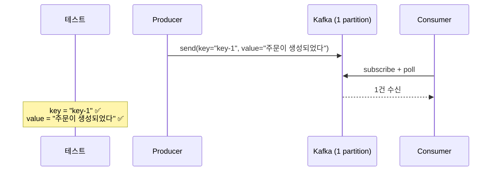

### 여러 메시지를 순서대로 발행하면 같은 파티션에서 순서대로 소비된다

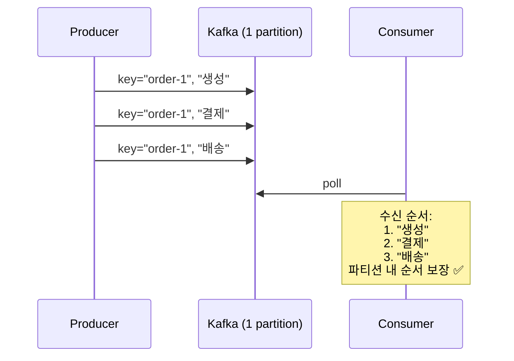

---

## KafkaMessagePreservationTest

Kafka의 메시지 보존 — Consumer가 중지되어도 메시지는 로그에 남아있다.

### Consumer가 중지된 사이에 발행된 메시지를 재시작 후 이어서 읽는다

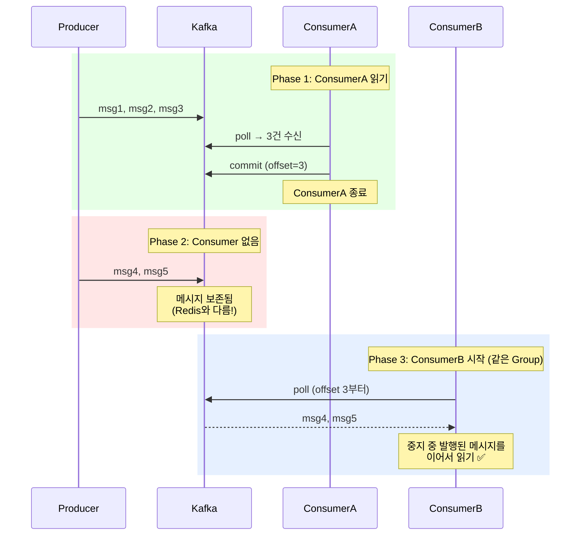

### 구독자가 없어도 메시지는 Kafka에 보존된다

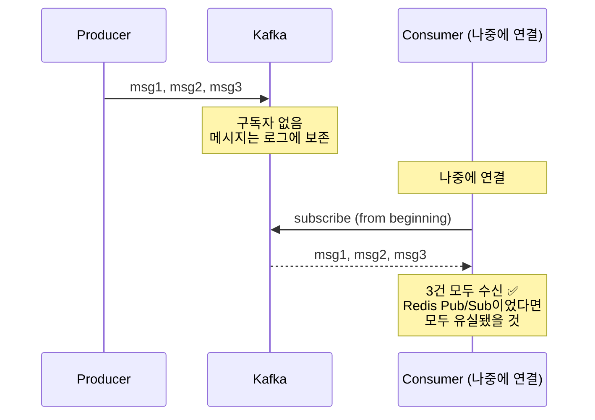

---

## KafkaConsumerGroupIndependenceTest

Consumer Group 간 독립적 소비 — 각 Group은 자기만의 offset을 관리한다.

### 두 Consumer Group이 같은 토픽의 모든 메시지를 각각 독립적으로 수신한다

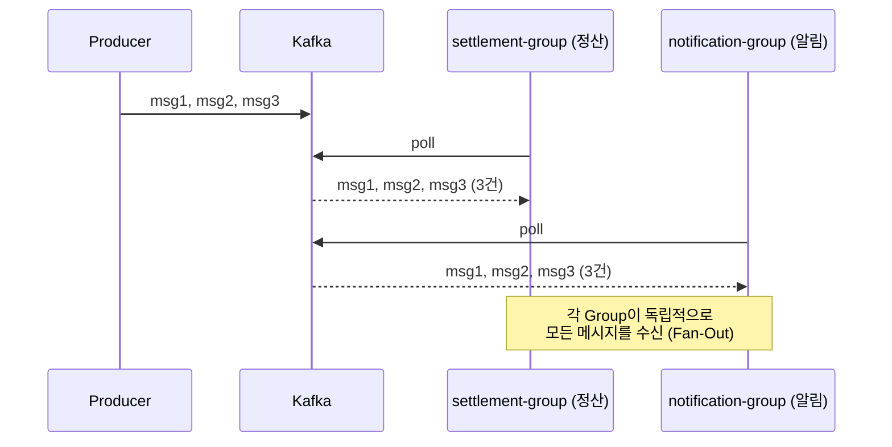

### 한 Consumer Group의 소비 속도가 다른 Group에 영향을 주지 않는다

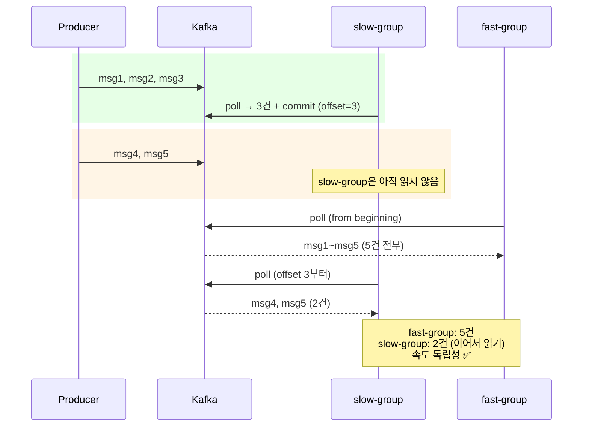

---

## KafkaPartitionOrderingTest

파티션 기반 순서 보장 — 같은 key → 같은 partition → 순서 보장.

### 같은 key의 메시지는 같은 파티션에 저장된다

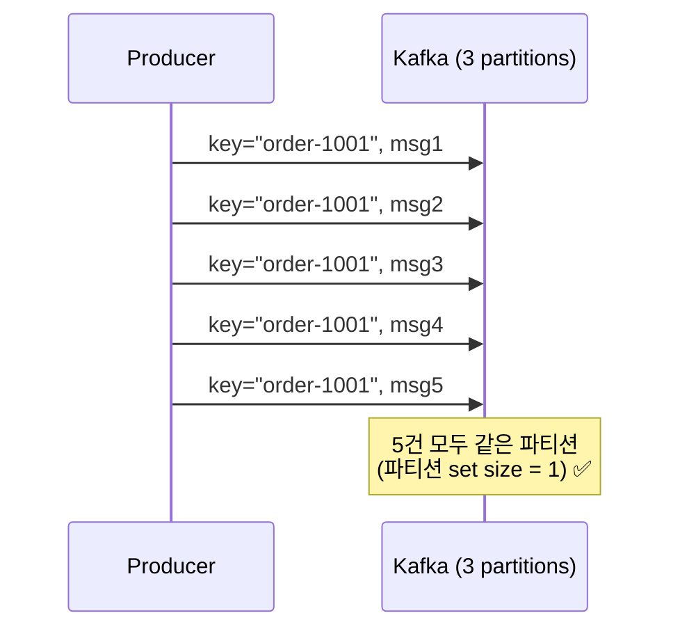

### 같은 파티션의 메시지는 발행 순서대로 소비된다

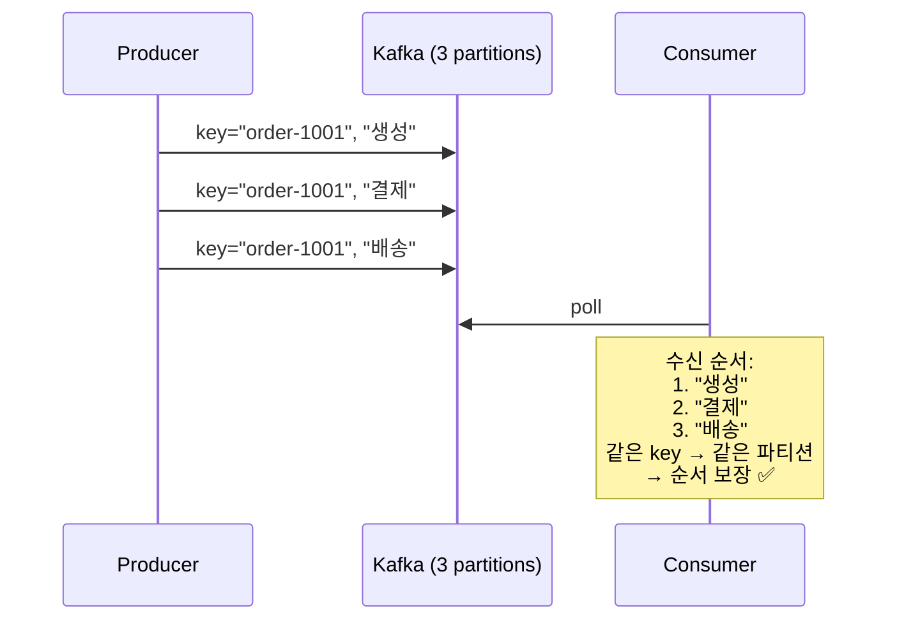

### 다른 key의 메시지는 다른 파티션으로 분배될 수 있다

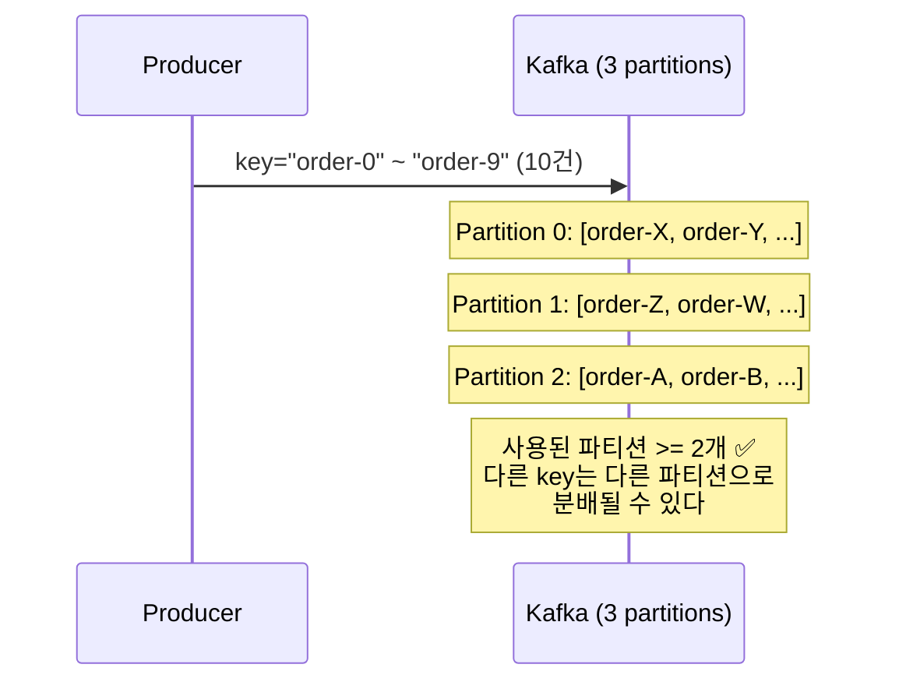

---

## TransactionalOutboxCompletionTest

Step 3의 Event Store + Kafka Relay = Transactional Outbox Pattern 완성.

```
Step 3이 해결한 것                      Step 5가 해결한 것
─────────────────────                  ─────────────────────
"이벤트가 유실되면 안 된다"                "이벤트가 프로세스 밖으로 나가야 한다"

도메인 저장 + 이벤트 기록                  Event Store → Kafka 릴레이
= 같은 TX (원자성)                       = 보존 + 비동기 전달

       합치면
       ──────
       Transactional Outbox Pattern
       "원자적으로 기록하고, 안전하게 전달한다"
```

### 주문 저장과 이벤트 기록이 하나의 트랜잭션으로 묶인다

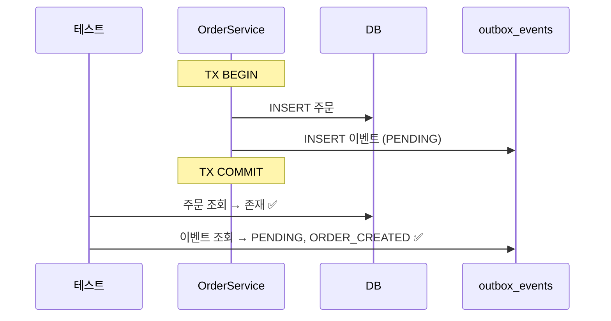

### 릴레이가 PENDING 이벤트를 Kafka로 발행하고 SENT로 변경한다

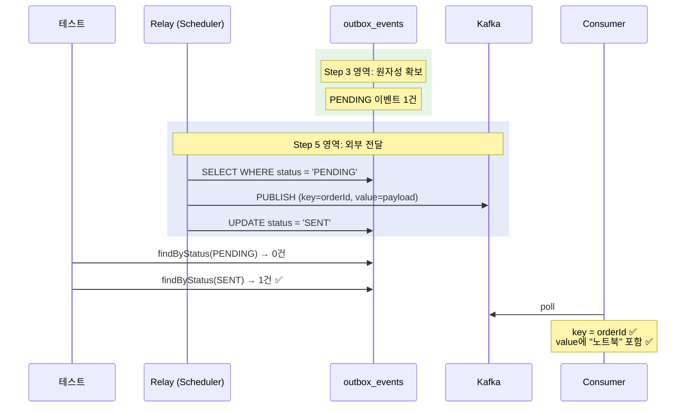

### Kafka 발행 실패 시 이벤트는 여전히 PENDING 상태를 유지한다

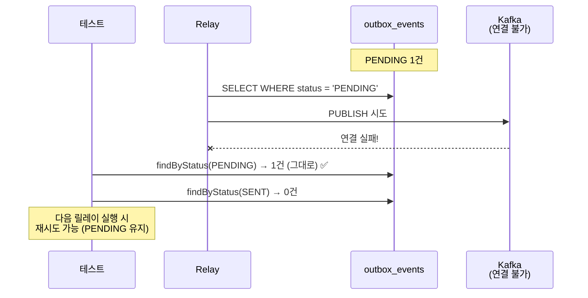

---

## 학습 포인트

이 Step을 마치면 다음 질문에 답할 수 있어야 합니다:

- [ ] Redis Pub/Sub에서 구독자가 없으면 메시지가 유실되는데, Kafka에서는 왜 보존되는가?
- [ ] Consumer Group A가 느려도 Group B에 영향이 없는 이유는?
- [ ] 같은 key의 메시지가 같은 파티션에 들어가면 왜 순서가 보장되는가?
- [ ] Step 3의 Event Store + 이 Step의 Kafka Relay = Transactional Outbox. 각각이 어떤 문제를 해결하는가?
- [ ] Kafka 발행이 실패하면 이벤트 상태가 왜 PENDING으로 남아야 하는가?

> `TransactionalOutboxCompletionTest`에서 Step 3의 원자성 테스트와 이 Step의 릴레이 테스트가 어떻게 연결되는지 비교해 보세요.

---

## Testcontainer

```
KafkaContainer("confluentinc/cp-kafka:7.6.0") - KRaft mode (ZooKeeper 불필요)
```

## 중복이 왜 발생하는가 -> Step 6

Kafka는 At Least Once 전달이 기본이다.
Consumer가 메시지를 처리한 뒤 offset을 커밋하기 직전에 죽으면,
재시작 시 같은 메시지를 다시 읽게 된다.
-> 포인트가 2번 적립되거나 쿠폰이 2번 발급된다.
